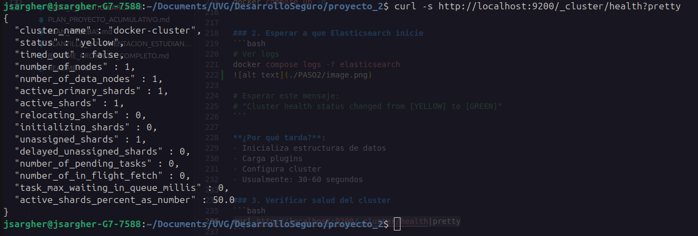
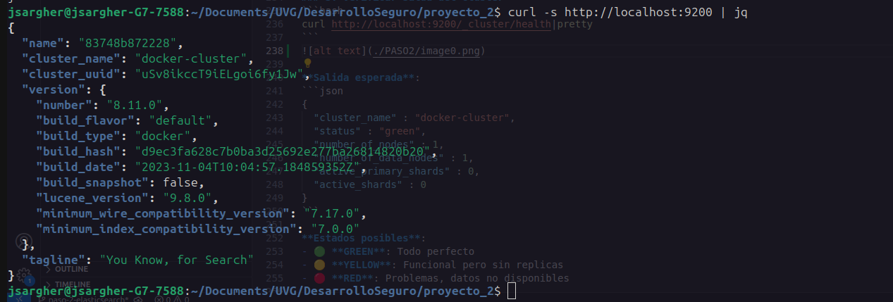
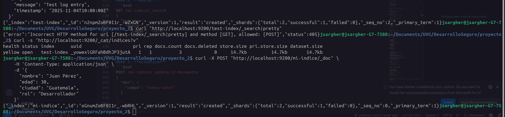
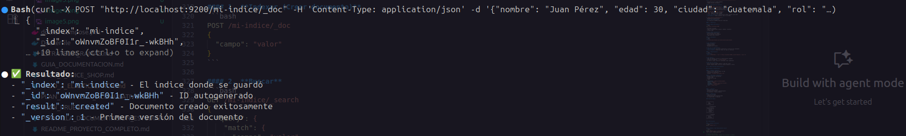

# Paso 2: Agregar Elasticsearch
<a id="readme-top"></a>

<!--
PROJECT DESCRIPTION
-->
## 📜 Descripción

Implementar Elasticsearch como motor de almacenamiento y búsqueda de logs.

**Elasticsearch** es un motor de búsqueda y análisis distribuido, basado en Apache Lucene.

### Características principales:
- **Búsqueda en tiempo real**: Encuentra datos casi instantáneamente
- **Escalable**: Puede manejar petabytes de datos
- **RESTful API**: Interactúa mediante HTTP/JSON
- **Schema-free**: No necesita estructura predefinida
- **Distribuido**: Datos replicados y distribuidos

### ¿Por qué Elasticsearch para logs?

#### Ventajas específicas:

1. **Indexación automática**:
   - Cada log se indexa al guardarse
   - Búsquedas extremadamente rápidas
   - No necesitas definir estructura previa

2. **Búsqueda full-text**:
   ```json
   {
     "query": {
       "match": {
         "message": "error database"
       }
     }
   }
   ```
   Encuentra todos los logs que contengan "error" y "database"

3. **Agregaciones**:
   - Cuenta errores por hora
   - Agrupa por tipo de request
   - Calcula promedios de tiempo de respuesta

4. **Escalabilidad**:
   - Empieza con 1 nodo
   - Crece a cientos de nodos sin cambiar código

## 📦 Requisitos

- Docker
- Docker Compose
- curl (para pruebas de API)

## 📋 Componentes Implementados

### Configuración en docker-compose.yml

```yaml
elasticsearch:
  image: docker.elastic.co/elasticsearch/elasticsearch:8.11.0
  container_name: elasticsearch
  environment:
    - discovery.type=single-node
    - "ES_JAVA_OPTS=-Xms512m -Xmx512m"
    - xpack.security.enabled=false
    - xpack.security.enrollment.enabled=false
  ports:
    - "9200:9200"
    - "9300:9300"
  volumes:
    - elasticsearch-data:/usr/share/elasticsearch/data
  networks:
    - elk-network
  healthcheck:
    test: ["CMD-SHELL", "curl -f http://localhost:9200/_cluster/health || exit 1"]
    interval: 30s
    timeout: 10s
    retries: 5
```

### Explicación detallada:

#### 1. **Imagen**
```yaml
image: docker.elastic.co/elasticsearch/elasticsearch:8.11.0
```
- Versión 8.11.0 (última estable)
- Imagen oficial de Elastic

#### 2. **Variables de entorno**

**`discovery.type=single-node`**
- Configura Elasticsearch para un solo nodo
- En producción usarás múltiples nodos
- Simplifica la configuración para desarrollo

**`ES_JAVA_OPTS=-Xms512m -Xmx512m`**
- `-Xms`: Memoria inicial (512MB)
- `-Xmx`: Memoria máxima (512MB)
- **¿Por qué limitar?**: Elasticsearch puede consumir mucha RAM
- **Ajustable**: Puedes aumentar según tu sistema

**`xpack.security.enabled=false`**
- Deshabilita autenticación
- **Solo para desarrollo**
- En producción SIEMPRE habilitar seguridad

#### 3. **Puertos**

**Puerto 9200 (HTTP API)**:
```bash
curl http://localhost:9200
```
- API REST principal
- Todas las operaciones (buscar, indexar, eliminar)
- Formato JSON

**Puerto 9300 (Transport)**:
- Comunicación entre nodos
- No lo usaremos directamente
- Importante para clusters

#### 4. **Volumen**
```yaml
volumes:
  - elasticsearch-data:/usr/share/elasticsearch/data
```

**¿Qué almacena?**:
- Índices (datos)
- Configuraciones
- Metadatos del cluster

**¿Por qué es importante?**:
- **Persistencia**: Los datos sobreviven al reinicio del contenedor
- **Sin volumen**: Perderías todos los logs al reiniciar

#### 5. **Healthcheck**
```yaml
healthcheck:
  test: ["CMD-SHELL", "curl -f http://localhost:9200/_cluster/health || exit 1"]
```

**¿Qué hace?**:
- Cada 30 segundos verifica si Elasticsearch responde
- Consulta el endpoint `/_cluster/health`
- Si falla 5 veces, marca el contenedor como "unhealthy"

**¿Por qué es útil?**:
- Otros servicios pueden esperar a que esté listo
- Docker Compose puede reiniciar automáticamente si falla

## 💡 ¿Cómo funciona Elasticsearch?

### Conceptos fundamentales:

#### 1. **Índice (Index)**
- Similar a una "base de datos" en SQL
- Colección de documentos
- Ejemplo: `filebeat-logs-2025.11.04`

#### 2. **Documento (Document)**
- Unidad básica de información
- Formato JSON
- Ejemplo de un log:
```json
{
  "@timestamp": "2025-11-04T10:30:00Z",
  "level": "ERROR",
  "message": "Database connection failed",
  "container": "juice-shop",
  "host": "docker-host"
}
```

#### 3. **Shard**
- División de un índice
- Permite distribución y paralelización
- Por defecto: 1 shard primario

#### 4. **Replica**
- Copia de un shard
- Proporciona alta disponibilidad
- En single-node: 0 replicas

### Flujo de datos:

```
|||||||||||||||
|   Log       |
|  (JSON)     |
|||||||||||||||
       |
       │ Indexación
|||||||||||||||
| Elasticsearch|
|  - Analiza  |
|  - Tokeniza |
|  - Indexa   |
|||||||||||||||
       |
       | Almacena
|||||||||||||||
|   Disco     |
|  (Volumen)  |
|||||||||||||||
```

## ✅ Verificación

### 1. Levantar servicios
```bash
docker compose up -d
```

### 2. Esperar a que Elasticsearch inicie
```bash
# Ver logs
docker compose logs -f elasticsearch


# Esperar este mensaje:
# "Cluster health status changed from [YELLOW] to [GREEN]"
```

**¿Por qué tarda?**:
- Inicializa estructuras de datos
- Carga plugins
- Configura cluster
- Usualmente: 30-60 segundos

### 3. Verificar salud del cluster
```bash
curl http://localhost:9200/_cluster/health|pretty
```


**Salida esperada**:
```json
{
  "cluster_name" : "docker-cluster",
  "status" : "green",
  "number_of_nodes" : 1,
  "number_of_data_nodes" : 1,
  "active_primary_shards" : 0,
  "active_shards" : 0
}
```

**Estados posibles**:
- 🟢 **GREEN**: Todo perfecto
- 🟡 **YELLOW**: Funcional pero sin replicas
- 🔴 **RED**: Problemas, datos no disponibles

### 4. Ver información del nodo
```bash
curl http://localhost:9200
```


**Salida esperada**:
```json
{
  "name" : "elasticsearch",
  "cluster_name" : "docker-cluster",
  "cluster_uuid" : "...",
  "version" : {
    "number" : "8.11.0",
    ...
  },
  "tagline" : "You Know, for Search"
}
```

### 5. Crear un documento de prueba
```bash
curl -X POST "http://localhost:9200/test-index/_doc" \
  -H 'Content-Type: application/json' \
  -d '{
    "message": "Test log entry",
    "timestamp": "2025-11-04T10:00:00Z"
  }'
```


**Respuesta**:
```json
{
  "_index": "test-index",
  "_id": "auto-generated-id",
  "_version": 1,
  "result": "created"
}
```

### 6. Buscar el documento
```bash
curl "http://localhost:9200/test-index/_search|pretty"
```

### 7. Ver índices creados
```bash
curl "http://localhost:9200/_cat/indices|v"
```


**Salida**:
```
health status index      pri rep docs.count
yellow open   test-index   1   1          1
```

## 📚 API de Elasticsearch

### Operaciones principales:

#### 1. **Indexar (Crear documento)**
```bash
POST /mi-indice/_doc
{
  "campo": "valor"
}
```

#### 2. **Buscar**
```bash
GET /mi-indice/_search
{
  "query": {
    "match": {
      "campo": "valor"
    }
  }
}
```

#### 3. **Actualizar**
```bash
POST /mi-indice/_update/id-documento
{
  "doc": {
    "campo": "nuevo-valor"
  }
}
```



#### 4. **Eliminar**
```bash
DELETE /mi-indice/_doc/id-documento
```

## 🏗️ Arquitectura Actual

```
|||||||||||||||||||
|   Juice Shop    |
|  Puerto 3000    |
|  (Genera logs)  |
|||||||||||||||||||
         |
         │ (Próximo paso: Filebeat)
         |
|||||||||||||||||||
| Elasticsearch   |
|  Puerto 9200    |
|  (Almacena logs)|
|||||||||||||||||||
         |
         |
|||||||||||||||||||
|    Volumen      |
| (Persistencia)  |
|||||||||||||||||||
```

## 💡 Conceptos Clave

### RESTful API
- Usa HTTP methods (GET, POST, PUT, DELETE)
- Formato JSON para datos
- Stateless (sin estado)

### Inverted Index
- Estructura de datos que hace búsquedas rápidas
- Similar al índice de un libro
- Mapea palabras a documentos que las contienen

### Near Real-Time
- Los datos están disponibles ~1 segundo después de indexar
- Refresh interval configurable
- Balance entre velocidad y recursos

## 🔍 Troubleshooting

### Problema: Elasticsearch no inicia
```bash
# Ver logs
docker compose logs elasticsearch

# Buscar errores comunes:
# - "max virtual memory areas too low"
# - "Out of memory"
```

**Solución memoria virtual (Linux/Mac)**:
```bash
sudo sysctl -w vm.max_map_count=262144
```

### Problema: Status YELLOW
- Normal en single-node
- Significa: "Sin replicas"
- No afecta funcionalidad

### Problema: Puerto 9200 no responde
```bash
# Verificar que el contenedor está corriendo
docker compose ps

# Verificar logs
docker compose logs elasticsearch

# Esperar más tiempo (puede tardar 1-2 minutos)
```

## ➡️ Siguiente Paso

Con Elasticsearch funcionando, el siguiente paso es agregar **Kibana** para visualizar y explorar estos datos de forma gráfica.

Ver: `PASO_3_KIBANA.md`

## ✅ Resumen

| **Logrado**:
- [x] Elasticsearch corriendo en puerto 9200
- [x] Configurado para single-node
- [x] Volumen persistente para datos
- [x] Healthcheck funcional
- [x] Red compartida elk-network

| **Verificado**:
- [x] Cluster en estado GREEN
- [x] API respondiendo correctamente
- [x] Capaz de indexar y buscar documentos
- [x] Datos persistentes en volumen

| **Entendido**:
- [x] Cómo Elasticsearch indexa datos
- [x] Estructura de índices y documentos
- [x] API RESTful básica
- [x] Importancia de persistencia

<p align="right">(<a href="#readme-top">Ir al inicio</a>)</p>


jsargher@jsargher-G7-7588:~/Documents/UVG/DesarrolloSeguro/proyecto_2$ curl -X POST "http://localhost:9200/test-index/_doc" \
  -H 'Content-Type: application/json' \
  -d '{
    "message": "Test log entry",
    "timestamp": "2025-11-04T10:00:00Z"
  }'
{"_index":"test-index","_id":"omn4mZoBF0I1r_-wIRFt","_version":1,"result":"created","_shards":{"total":2,"successful":1,"failed":0},"_seq_no":3,"_primary_term":1}jsargher@jsargher-G7-7588:~/Documents/UVG/DesarrolloSeguro/proyecto_2$ curl "http://localhost:9200/test-index/_search?pretty"
{
  "took" : 6,
  "timed_out" : false,
  "_shards" : {
    "total" : 1,
    "successful" : 1,
    "skipped" : 0,
    "failed" : 0
  },
  "hits" : {
    "total" : {
      "value" : 4,
      "relation" : "eq"
    },
    "max_score" : 1.0,
    "hits" : [
      {
        "_index" : "test-index",
        "_id" : "nWnamZoBF0I1r_-wAhFC",
        "_score" : 1.0,
        "_source" : {
          "message" : "Test log entry",
          "timestamp" : "2025-11-18T10:00:00Z"
        }
      },
      {
        "_index" : "test-index",
        "_id" : "nmnomZoBF0I1r_-wBxGQ",
        "_score" : 1.0,
        "_source" : {
          "message" : "Test log entry PASO 2",
          "timestamp" : "2025-11-18T11:00:00Z"
        }
      },
      {
        "_index" : "test-index",
        "_id" : "n2npmZoBF0I1r_-wZxGN",
        "_score" : 1.0,
        "_source" : {
          "message" : "Test log entry",
          "timestamp" : "2025-11-04T10:00:00Z"
        }
      },
      {
        "_index" : "test-index",
        "_id" : "omn4mZoBF0I1r_-wIRFt",
        "_score" : 1.0,
        "_source" : {
          "message" : "Test log entry",
          "timestamp" : "2025-11-04T10:00:00Z"
        }
      }
    ]
  }
}
jsargher@jsargher-G7-7588:~/Documents/UVG/DesarrolloSeguro/proyecto_2$ curl "http://localhost:9200/_cat/indices?v"
health status index      uuid                   pri rep docs.count docs.deleted store.size pri.store.size dataset.size
yellow open   mi-indice  8eGx6_v8SI2igU7C3MjrPg   1   1          1            0      6.3kb          6.3kb        6.3kb
yellow open   test-index _yowexlGRFahBdhJP3jutA   1   1          4            0     19.6kb         19.6kb       19.6kb
jsargher@jsargher-G7-7588:~/Documents/UVG/DesarrolloSeguro/proyecto_2$ curl -X POST "http://localhost:9200/test-index/_update/TU_ID_AQUI" \
  -H 'Content-Type: application/json' \
  -d '{
    "doc": {
      "message": "Updated test log entry"
    }
  }'
{"error":{"root_cause":[{"type":"document_missing_exception","reason":"[TU_ID_AQUI]: document missing","index_uuid":"_yowexlGRFahBdhJP3jutA","shard":"0","index":"test-index"}],"type":"document_missing_exception","reason":"[TU_ID_AQUI]: document missing","index_uuid":"_yowexlGRFahBdhJP3jutA","shard":"0","index":"test-index"},"status":404}jsargher@jsargher-G7-7588:~/Djsargher@jsargher-G7-7588:~/Documents/UVG/DesarrolloSeguro/proyecto_2$ curl -X POST "http://localhost:9200/test-index/_update/omn4mZoBF0I1r_-wIRFt" \
  -H 'Content-Type: application/json' \
  -d '{
    "doc": {
      "message": "Updated test log entry"
    }
  }'
{"_index":"test-index","_id":"omn4mZoBF0I1r_-wIRFt","_version":2,"result":"updated","_shards":{"total":2,"successful":1,"failed":0},"_seq_no":4,"_primary_term":1}jsargher@jsargher-G7-7588:~/Documents/UVG/DesarrolloSeguro/proyecto_2$ curl "http://localhost:9200/test-index/_search?pretty"
{
  "took" : 4,
  "timed_out" : false,
  "_shards" : {
    "total" : 1,
    "successful" : 1,
    "skipped" : 0,
    "failed" : 0
  },
  "hits" : {
    "total" : {
      "value" : 4,
      "relation" : "eq"
    },
    "max_score" : 1.0,
    "hits" : [
      {
        "_index" : "test-index",
        "_id" : "nWnamZoBF0I1r_-wAhFC",
        "_score" : 1.0,
        "_source" : {
          "message" : "Test log entry",
          "timestamp" : "2025-11-18T10:00:00Z"
        }
      },
      {
        "_index" : "test-index",
        "_id" : "nmnomZoBF0I1r_-wBxGQ",
        "_score" : 1.0,
        "_source" : {
          "message" : "Test log entry PASO 2",
          "timestamp" : "2025-11-18T11:00:00Z"
        }
      },
      {
        "_index" : "test-index",
        "_id" : "n2npmZoBF0I1r_-wZxGN",
        "_score" : 1.0,
        "_source" : {
          "message" : "Test log entry",
          "timestamp" : "2025-11-04T10:00:00Z"
        }
      },
      {
        "_index" : "test-index",
        "_id" : "omn4mZoBF0I1r_-wIRFt",
        "_score" : 1.0,
        "_source" : {
          "message" : "Updated test log entry",
          "timestamp" : "2025-11-04T10:00:00Z"
        }
      }
    ]
  }
}
jsargher@jsargher-G7-7588:~/Documents/UVG/DesarrolloSeguro/proyecto_2$ curl -X DELETE "http://localhost:9200/test-index/_doc/omn4mZoBF0I1r_-wIRFt"
{"_index":"test-index","_id":"omn4mZoBF0I1r_-wIRFt","_version":3,"result":"deleted","_shards":{"total":2,"successful":1,"failed":0},"_seq_no":5,"_primary_term":1}jsargher@jsargher-G7-7588:~/Documents/UVG/DesarrolloSeguro/proyecto_2$ curl "http://localhost:9200/test-index/_search?pretty"
{
  "took" : 8,
  "timed_out" : false,
  "_shards" : {
    "total" : 1,
    "successful" : 1,
    "skipped" : 0,
    "failed" : 0
  },
  "hits" : {
    "total" : {
      "value" : 3,
      "relation" : "eq"
    },
    "max_score" : 1.0,
    "hits" : [
      {
        "_index" : "test-index",
        "_id" : "nWnamZoBF0I1r_-wAhFC",
        "_score" : 1.0,
        "_source" : {
          "message" : "Test log entry",
          "timestamp" : "2025-11-18T10:00:00Z"
        }
      },
      {
        "_index" : "test-index",
        "_id" : "nmnomZoBF0I1r_-wBxGQ",
        "_score" : 1.0,
        "_source" : {
          "message" : "Test log entry PASO 2",
          "timestamp" : "2025-11-18T11:00:00Z"
        }
      },
      {
        "_index" : "test-index",
        "_id" : "n2npmZoBF0I1r_-wZxGN",
        "_score" : 1.0,
        "_source" : {
          "message" : "Test log entry",
          "timestamp" : "2025-11-04T10:00:00Z"
        }
      }
    ]
  }
}
jsargher@jsargher-G7-7588:~/Documents/UVG/DesarrolloSeguro/proyecto_2$ 

