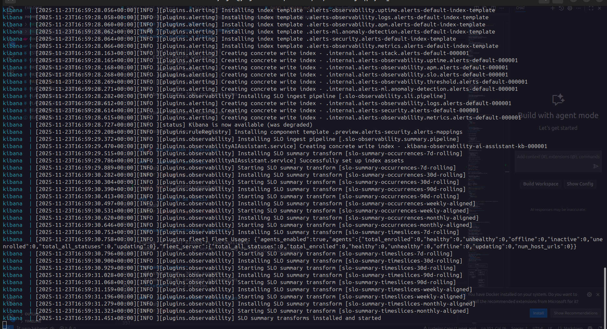

# Paso 3: Agregar Kibana
<a id="readme-top"></a>

<!--
PROJECT DESCRIPTION
-->
## 📜 Descripción

Implementar Kibana como interfaz visual para explorar y analizar los datos almacenados en Elasticsearch.

**Kibana** es la interfaz de visualización oficial para Elasticsearch, desarrollada por Elastic.

### Características principales:
1. **Discover**: Explora logs en tiempo real
2. **Visualize**: Crea gráficos (barras, líneas, pie charts)
3. **Dashboard**: Combina múltiples visualizaciones
4. **Dev Tools**: Consola para queries directas
5. **Management**: Configura índices y patrones

### ¿Por qué necesitamos Kibana?

**Sin Kibana** (solo Elasticsearch):
```bash
# Buscar logs con curl
curl -X GET "http://localhost:9200/logs/_search" \
  -H 'Content-Type: application/json' \
  -d '{
    "query": {
      "match": {
        "message": "error"
      }
    }
  }'

# Respuesta: JSON crudo, difícil de leer
{
  "hits": {
    "total": 1523,
    "hits": [
      {"_source": {"message": "error 1", ...}},
      {"_source": {"message": "error 2", ...}},
      ...
    ]
  }
}
```

**Con Kibana**:
1. Abres http://localhost:5601
2. Vas a Discover
3. Escribes "error" en la barra de búsqueda
4. Ves resultados en tabla interactiva
5. Creas gráfico de errores por hora con 3 clicks

## 🔗 Relación con pasos anteriores

### Flujo de datos hasta ahora:
```
PASO 1: Juice Shop          PASO 2: Elasticsearch       PASO 3: Kibana
|||||||||||||||              ||||||||||||||||           ||||||||||||||||
| Juice Shop  |              |              |           |              |
|             |              | Elasticsearch|||||||||||||   Kibana     |
| Genera logs |||||||||||||||||              |  Consulta |  (Interfaz)  |
| (Todav|a no |  (Pr|ximo    | Almacena     |  datos    |              |
|  conectado) |   paso)      | logs         |           |              |
|||||||||||||||              ||||||||||||||||           ||||||||||||||||
                                    |                          |
                                    |                          |
                                    ||||||||||||||||||||||||||||
                                       Usuario visualiza logs
```

### ¿Cómo se relacionan?

**Elasticsearch (Paso 2)** es el **backend**:
- Almacena los datos
- Procesa búsquedas
- Realiza agregaciones
- No tiene interfaz gráfica

**Kibana (Paso 3)** es el **frontend**:
- Se conecta a Elasticsearch
- Traduce clicks en queries
- Muestra resultados visualmente
- Crea gráficos y dashboards

**Analogía**:
- Elasticsearch = Base de datos MySQL
- Kibana = phpMyAdmin (interfaz web para MySQL)

## 📦 Requisitos

- Docker
- Docker Compose
- Elasticsearch funcionando (Paso 2)
- Navegador web

## 📋 Componentes Implementados

### Configuración en docker-compose.yml

```yaml
kibana:
  image: docker.elastic.co/kibana/kibana:8.11.0
  container_name: kibana
  ports:
    - "5601:5601"
  environment:
    - ELASTICSEARCH_HOSTS=http://elasticsearch:9200
    - ELASTICSEARCH_URL=http://elasticsearch:9200
  networks:
    - elk-network
  depends_on:
    elasticsearch:
      condition: service_healthy
  restart: unless-stopped
  healthcheck:
    test: ["CMD-SHELL", "curl -f http://localhost:5601/api/status || exit 1"]
    interval: 30s
    timeout: 10s
    retries: 5
```

### Explicación detallada:

#### 1. **Imagen**
```yaml
image: docker.elastic.co/kibana/kibana:8.11.0
```
- **Misma versión que Elasticsearch (8.11.0)**: ⚠️ IMPORTANTE!
- Las versiones deben coincidir
- Incompatibilidades pueden causar errores

**¿Por qué la misma versión?**:
- API de Elasticsearch cambia entre versiones
- Kibana está optimizado para su versión correspondiente
- Evita bugs y problemas de compatibilidad

#### 2. **Puerto**
```yaml
ports:
  - "5601:5601"
```
- **5601**: Puerto estándar de Kibana
- Interfaz web accesible en http://localhost:5601
- Solo necesita un puerto (es una aplicación web)

#### 3. **Variables de entorno**

**`ELASTICSEARCH_HOSTS=http://elasticsearch:9200`**

Esta es la configuración **MÁS IMPORTANTE**:

```
|||||||||||||||
|   Kibana    |
| Container   |
|||||||||||||||
       |
       | http://elasticsearch:9200
       |
       |
|||||||||||||||
|Elasticsearch|
| Container   |
|||||||||||||||
```

**¿Por qué "elasticsearch" y no "localhost"?**:
- Dentro de Docker, cada contenedor tiene su propio "localhost"
- "elasticsearch" es el **nombre del servicio** en docker-compose
- Docker DNS resuelve "elasticsearch" → IP del contenedor

**Prueba conceptual**:
```bash
# Desde tu máquina (funciona)
curl http://localhost:9200

# Desde dentro de Kibana (NO funciona)
curl http://localhost:9200  # → Buscaría en el mismo contenedor

# Desde dentro de Kibana (funciona)
curl http://elasticsearch:9200  # → Encuentra el otro contenedor
```

#### 4. **Red compartida**
```yaml
networks:
  - elk-network
```

**¿Qué hace?**:
- Ambos contenedores (Kibana y Elasticsearch) están en la misma red
- Pueden comunicarse usando nombres de servicio
- Aislados de otros contenedores

**Sin red compartida**:
```
|||||||||||        |||||||||||||||
| Kibana  |   |    |Elasticsearch|
| Red A   |        |   Red B     |
|||||||||||        |||||||||||||||
    No se pueden comunicar
```

**Con red compartida (elk-network)**:
```
||||||||||||||||||||||||||||||||
|       elk-network            |
|  |||||||||||  |||||||||||||||
|  | Kibana  ||||Elasticsearch||
|  |||||||||||  |||||||||||||||
||||||||||||||||||||||||||||||||
    Se comunican libremente
```

#### 5. **depends_on con healthcheck**
```yaml
depends_on:
  elasticsearch:
    condition: service_healthy
```

**¿Qué hace?**:
1. Docker Compose inicia Elasticsearch primero
2. Espera a que el healthcheck de Elasticsearch pase
3. Solo entonces inicia Kibana

**¿Por qué es necesario?**:

**Sin depends_on**:
```
t=0s:  Elasticsearch inicia →
t=0s:  Kibana inicia        →  Ambos al mismo tiempo
t=5s:  Kibana intenta conectar a Elasticsearch
       → ERROR: Elasticsearch no está listo
       Kibana falla y se reinicia
t=30s: Elasticsearch finalmente está listo
t=35s: Kibana se reinicia y conecta
       → Funciona, pero tardó más
```

**Con depends_on + healthcheck**:
```
t=0s:  Elasticsearch inicia
t=30s: Elasticsearch healthcheck pasa →
t=30s: Kibana inicia
t=35s: Kibana conecta a Elasticsearch
       → Funciona a la primera
```

#### 6. **Healthcheck de Kibana**
```yaml
healthcheck:
  test: ["CMD-SHELL", "curl -f http://localhost:5601/api/status || exit 1"]
```

**¿Qué verifica?**:
- Endpoint `/api/status` de Kibana
- Retorna información sobre el estado de Kibana

**Respuesta del endpoint**:
```json
{
  "status": {
    "overall": {
      "state": "green",
      "title": "Green"
    }
  }
}
```

**Estados posibles**:
- 🟢 **green**: Todo funcionando
- 🟡 **yellow**: Funcional con advertencias
- 🔴 **red**: Problemas críticos

## 🔄 Flujo de comunicación completo

### Cuando accedes a Kibana:

```
1. Usuario abre navegador
   |
   |
2. http://localhost:5601
   |
   |
3. |||||||||||||||||||||||
   |  Kibana Container   |
   |  - Carga interfaz   |
   |  - Muestra UI       |
   |||||||||||||||||||||||
              |
4. Usuario busca "error" en Discover
   |
   |
5. Kibana traduce a query de Elasticsearch:
   {
     "query": {
       "match": {
         "message": "error"
       }
     }
   }
   |
   |
6. Kibana envía query a:
   http://elasticsearch:9200/logs/_search
   |
   |
7. |||||||||||||||||||||||||||
   | Elasticsearch Container |
   | - Recibe query          |
   | - Busca en índices      |
   | - Retorna resultados    |
   |||||||||||||||||||||||||||
              |
8. Kibana recibe JSON con resultados
   |
   |
9. Kibana formatea y muestra en tabla
   |
   |
10. Usuario ve logs en pantalla
```

## 🚀 Instalación y Ejecución

### 1. Levantar servicios
```bash
docker compose up -d
```


### 2. Ver logs de inicio
```bash
docker compose logs -f kibana
```

**Mensajes importantes a buscar**:
```
kibana  | [info] Kibana is now available
kibana  | [info] http server running at http://0.0.0.0:5601
```

**¿Cuánto tarda?**:
- Elasticsearch: 30-60 segundos
- Kibana: 30-45 segundos adicionales
- **Total**: ~1-2 minutos

### 3. Verificar estado de servicios
```bash
docker compose ps
```

**Salida esperada**:
```
NAME            STATUS
elasticsearch   Up (healthy)
kibana          Up (healthy)
juice-shop      Up
```

### 4. Verificar conectividad Kibana → Elasticsearch
```bash
# Desde tu máquina, pregunta a Kibana su estado
curl http://localhost:5601/api/status
```

**Respuesta esperada**:
```json
{
  "status": {
    "overall": {
      "state": "green"
    },
    "core": {
      "elasticsearch": {
        "level": "available"
      }
    }
  }
}
```

**Clave**: `"elasticsearch": {"level": "available"}` confirma que Kibana ve a Elasticsearch.

### 5. Acceder a la interfaz web

**Abre en tu navegador**: http://localhost:5601

**Primera vez que accedes**:
1. Verás pantalla de bienvenida
2. Puede pedir configuración inicial
3. Click en "Explore on my own"

### 6. Verificar conexión desde Kibana UI

En Kibana:
1. Ve al menú (☰) → **Management** → **Dev Tools**
2. Escribe en la consola:
```
GET /
```
3. Click en el botón ▶️ (Play)

**Respuesta esperada**:
```json
{
  "name" : "elasticsearch",
  "cluster_name" : "docker-cluster",
  "version" : {
    "number" : "8.11.0"
  }
}
```

Esto confirma que Kibana puede ejecutar queries en Elasticsearch.

## 🔍 Explorando Kibana

### Secciones principales:

#### 1. **Discover** (Explorar logs)
- Ruta: Analytics → Discover
- Función: Ver logs en tiempo real
- Uso: Buscar, filtrar, explorar

#### 2. **Visualize** (Crear gráficos)
- Ruta: Analytics → Visualize
- Función: Crear gráficos individuales
- Tipos: Barras, líneas, pie, mapas

#### 3. **Dashboard** (Paneles)
- Ruta: Analytics → Dashboard
- Función: Combina múltiples visualizaciones
- Uso: Vista general del sistema

#### 4. **Dev Tools** (Consola)
- Ruta: Management → Dev Tools
- Función: Ejecutar queries directamente
- Uso: Testing, debugging

#### 5. **Stack Management** (Configuración)
- Ruta: Management → Stack Management
- Función: Configurar índices, usuarios, etc.
- Uso: Administración

## 🧪 Prueba de integración

### Crear un log de prueba desde Elasticsearch:

```bash
# Crear un índice con un documento
curl -X POST "http://localhost:9200/test-logs/_doc" \
  -H 'Content-Type: application/json' \
  -d '{
    "@timestamp": "2025-11-04T10:00:00Z",
    "level": "INFO",
    "message": "Test log from Elasticsearch",
    "service": "test"
  }'
```

### Ver el log en Kibana:

1. Abre Kibana: http://localhost:5601
2. Ve a **Management** → **Stack Management** → **Data Views**
3. Click **Create data view**
4. Configuración:
   - **Name**: Test Logs
   - **Index pattern**: `test-logs*`
   - **Timestamp field**: `@timestamp`
5. Click **Save data view**
6. Ve a **Analytics** → **Discover**
7. Selecciona "Test Logs" en el dropdown
8. ¡Deberías ver tu log!

## 🏗️ Arquitectura Actual

```
||||||||||||||||||||||||||||||||||||||||||||||||||||||||||||
|                     TU M|QUINA                           |
|                                                          |
|  Navegador ||||||| http://localhost:5601 (Kibana UI)   |
|                                                          |
||||||||||||||||||||||||||||||||||||||||||||||||||||||||||||
                         |
                         | HTTP
                         |
||||||||||||||||||||||||||||||||||||||||||||||||||||||||||||
|                    DOCKER - elk-network                  |
|                                                          |
|  |||||||||||||||||||         ||||||||||||||||||||      |
|  |  Juice Shop     |         |   Kibana         |      |
|  |  Puerto 3000    |         |   Puerto 5601    |      |
|  |                 |         |                  |      |
|  | (Genera logs)   |         | (Visualiza logs) |      |
|  |||||||||||||||||||         ||||||||||||||||||||      |
|                                       |                 |
|         (Pr|ximo paso:                |                 |
|          conectar con                 |                 |
|          Filebeat)                    |                 |
|                                       |                 |
|                                       |                 |
|                              ||||||||||||||||||||       |
|                              | Elasticsearch    |       |
|                              | Puerto 9200      |       |
|                              |                  |       |
|                              | (Almacena logs)  |       |
|                              ||||||||||||||||||||       |
|                                       |                 |
|                                       |                 |
|                              ||||||||||||||||||||       |
|                              |  Volumen         |       |
|                              |  (Persistencia)  |       |
|                              ||||||||||||||||||||       |
||||||||||||||||||||||||||||||||||||||||||||||||||||||||||||
```

## 💡 Conceptos Clave

### 1. **Data View (antes Index Pattern)**
- Define qué índices de Elasticsearch mostrar en Kibana
- Usa wildcards: `logs-*` muestra todos los índices que empiecen con "logs-"
- Necesario antes de usar Discover

### 2. **KQL (Kibana Query Language)**
```
# Buscar logs con "error"
message: error

# Buscar logs de un servicio específico
service: "juice-shop"

# Combinar condiciones
service: "juice-shop" AND level: "ERROR"

# Rangos de tiempo
@timestamp >= "2025-11-04"
```

### 3. **Time Filter**
- Selector en la esquina superior derecha
- Opciones: Last 15 minutes, Last 1 hour, Last 7 days, etc.
- Crucial para limitar búsquedas

### 4. **Saved Searches**
- Guarda búsquedas frecuentes
- Reutilizables en dashboards
- Ahorra tiempo

## ➡️ Siguiente Paso

**Estado actual**:
- ✅ Juice Shop genera logs
- ✅ Elasticsearch puede almacenar logs
- ✅ Kibana puede visualizar logs
- ⚠️ **FALTA**: Conectar Juice Shop → Elasticsearch

**Próximo paso (Filebeat)**:
```
|||||||||||||||
| Juice Shop  |
|             |
| Logs |||||||||||
|||||||||||||||  |
                 |
                 |
            ┌──────────┐
            │ Filebeat │ ← Próximo paso
            │(Recolector)│
            └────┬─────┘
                 |
                 |
         ||||||||||||||||
         |Elasticsearch |
         ||||||||||||||||
                |
                |
         ||||||||||||||||
         |   Kibana     |
         ||||||||||||||||
```

Filebeat será el "puente" que:
1. Lee los logs de Juice Shop
2. Los procesa y formatea
3. Los envía a Elasticsearch
4. Kibana los muestra automáticamente

Ver: `PASO_4_FILEBEAT.md`

## 🔧 Troubleshooting

### Problema: Kibana no carga
```bash
# Verificar que Elasticsearch está healthy
docker compose ps

# Ver logs de Kibana
docker compose logs kibana

# Buscar errores de conexión
```

### Problema: "Kibana server is not ready yet"
- **Causa**: Kibana aún está iniciando
- **Solución**: Esperar 1-2 minutos más
- **Verificar**: `docker compose logs kibana`

### Problema: No puede conectar a Elasticsearch
```bash
# Verificar que están en la misma red
docker network inspect proyecto_2_elk-network

# Deberías ver ambos contenedores listados
```

### Problema: Versiones incompatibles
- **Síntoma**: Errores raros, features no funcionan
- **Solución**: Verificar que Kibana y Elasticsearch tienen la misma versión
```bash
# Ver versión de Elasticsearch
curl http://localhost:9200

# Ver versión de Kibana
curl http://localhost:5601/api/status
```

## ✅ Resumen

### Logrado
- [x] Kibana corriendo en puerto 5601
- [x] Conectado exitosamente a Elasticsearch
- [x] Interfaz web accesible
- [x] Healthcheck funcional
- [x] Dependencia de Elasticsearch configurada

### Verificado
- [x] Kibana puede consultar Elasticsearch
- [x] Interfaz web responde correctamente
- [x] Dev Tools funcional
- [x] Puede crear Data Views

### Entendido
- [x] Cómo Kibana se comunica con Elasticsearch
- [x] Importancia de la red compartida
- [x] Uso de nombres de servicio en Docker
- [x] Dependencias entre servicios
- [x] Flujo de datos: Usuario → Kibana → Elasticsearch → Usuario

<p align="right">(<a href="#readme-top">Ir al inicio</a>)</p>
