# Plantilla de Documentación - Proyecto ELK Stack

**Nombre del Estudiante**: Astrid Glauser, Alejandro Martinez, Samuel Argueta  
**Carnet**: 21299, 21430, 211024
**Fecha de Inicio**: ___________________________  
**Fecha de Entrega**: 25 de noviembre 2025
---

## 📋 Índice

1. [Resumen Ejecutivo](#resumen-ejecutivo)
2. [Paso 1: Juice Shop Básico](#paso-1-juice-shop-básico)
3. [Paso 2: Elasticsearch](#paso-2-elasticsearch)
4. [Paso 3: Kibana](#paso-3-kibana)
5. [Paso 4: Filebeat](#paso-4-filebeat)
6. [Paso 5: Visualización en Kibana](#paso-5-visualización-en-kibana)
7. [Paso 6: Blue Team](#paso-6-blue-team)
8. [Actividades Red Team](#actividades-red-team)
9. [Análisis Técnico](#análisis-técnico)
10. [Problemas y Soluciones](#problemas-y-soluciones)
11. [Conceptos Aprendidos](#conceptos-aprendidos)
12. [Conclusiones](#conclusiones)
13. [Referencias](#referencias)
14. [Anexos](#anexos)

---

## Resumen Ejecutivo

### Descripción del Proyecto
Este proyecto implementa un sistema completo de monitoreo y detección de amenazas utilizando el stack ELK (Elasticsearch, Logstash, Kibana) junto con OWASP Juice Shop como aplicación vulnerable para pruebas de seguridad. El sistema captura logs HTTP en tiempo real a través de un proxy Nginx, los procesa con Filebeat, los almacena en Elasticsearch y los visualiza en Kibana.

El objetivo principal es poder simular ataques (Red Team) y detectarlos mediante reglas automatizadas (Blue Team), permitiendo el análisis forense de tráfico malicioso incluyendo SQL Injection, Cross-Site Scripting (XSS) y scanning de directorios.

La arquitectura implementada captura cada request HTTP con su payload completo, incluyendo parámetros de query string donde típicamente se inyectan ataques, permitiendo la detección, análisis y respuesta a incidentes de seguridad en tiempo real.


### Objetivos Cumplidos
- [x] Sistema ELK Stack completamente funcional
- [x] Logs recolectándose en tiempo real
- [ ] Visualizaciones y dashboards creados
- [ ] Reglas de detección configuradas
- [ ] Vulnerabilidades identificadas y documentadas

### Tecnologías Utilizadas
- Docker y Docker Compose
- OWASP Juice Shop
- Elasticsearch 8.11.0
- Kibana 8.11.0
- Filebeat 8.11.0
- [Otras herramientas utilizadas]

### Tiempo Invertido
| Fase | Tiempo Estimado | Tiempo Real |
|------|----------------|-------------|
| Paso 1: Juice Shop | 30 min | 10 min |
| Paso 2: Elasticsearch | 45 min | 20 min |
| Paso 3: Kibana | 45 min | ___ min |
| Paso 4: Filebeat | 1 hora | ___ min |
| Paso 5: Visualización | 1.5 horas | ___ min |
| Paso 6: Blue Team | 2 horas | ___ min |
| Red Team | 3 horas | ___ min |
| Documentación | 2 horas | ___ min |
| **TOTAL** | **~11 horas** | **___ horas** |

---

## Paso 1: Juice Shop Básico

### Objetivo
Configurar y ejecutar OWASP Juice Shop como aplicación base que generará logs para el sistema de monitoreo.

### Rama Git Utilizada
```bash
git checkout paso-1-juice-shop
```

### Comandos Ejecutados

#### 1.1 Levantar el servicio
```bash
docker compose up -d
```

**Output**:
```
[Pegar el output del comando aquí]
```

#### 1.2 Verificar estado
```bash
docker compose ps
```

**Output**:
```
[Pegar el output del comando aquí]
```

#### 1.3 Probar conectividad
```bash
curl -I http://localhost:3000
```

**Output**:
```
[Pegar el output del comando aquí]
```

#### 1.4 Generar logs de prueba
```bash
for i in {1..10}; do 
  curl -s http://localhost:3000 > /dev/null
  echo "Request $i completada"
  sleep 1
done
```

**Output**:
```
[Pegar el output del comando aquí]
```

### Screenshots

#### Screenshot 1.1: Docker Compose PS


**Descripción**: Muestra el contenedor juice-shop corriendo en estado "Up" con el puerto 3000 mapeado.

**Verificación**:
- [x] Contenedor en estado "Up"
- [x] Puerto 3000:3000 mapeado
- [x] Sin errores visibles

#### Screenshot 1.2: Interfaz Web de Juice Shop


**Descripción**: Página principal de Juice Shop cargada correctamente en el navegador.

**Verificación**:
- [x] Página carga sin errores
- [x] Productos visibles
- [x] URL correcta (localhost:3000)

#### Screenshot 1.3: Curl Test


**Descripción**: Respuesta HTTP del servidor mostrando código 200 OK.

#### Screenshot 1.4: Logs del Contenedor


**Descripción**: Logs mostrando el mensaje "Server listening on port 3000" y requests HTTP.

### Problemas Encontrados

#### Problema 1: [Descripción del problema]
**Error**: 
```
[Mensaje de error exacto]
```

**Causa**: [Explicación de por qué ocurrió]

**Solución**: 
```bash
[Comandos para resolver]
```

**Resultado**: [Qué pasó después de aplicar la solución]

### Verificación de Éxito

- [x] Contenedor corriendo sin errores
- [x] Puerto 3000 accesible
- [x] Interfaz web funcional
- [x] Logs generándose correctamente
- [x] Screenshots capturados (4)

### Conceptos Aprendidos

1. **Docker Compose**: [Explicación de qué aprendiste]
2. **Port Mapping**: [Explicación]
3. **Container Logs**: [Explicación]

### Tiempo Invertido
- **Estimado**: 30 minutos
- **Real**: ___ minutos

---
## Actividades Red Team

### Vulnerabilidad 1 — SQL Injection (Login Bypass)

**Clasificación**: OWASP A03:2021 – Injection  
**CVSS v3.1**: 9.8 CRITICAL  
**Endpoint vulnerable**: `POST /rest/user/login`  
**Ruta en la aplicación**: `http://localhost:3000/#/login`  

---

#### 1. Descripción técnica

Durante la fase de pruebas del Red Team en la aplicación **OWASP Juice Shop**, se identificó una vulnerabilidad crítica de **inyección SQL** en el formulario de autenticación.

El parámetro `email` enviado desde el formulario de login se utiliza directamente dentro de una consulta SQL **sin sanitización** ni uso de *prepared statements*. Esto permite:

- Cerrar la cadena original del correo.
- Inyectar una condición booleana siempre verdadera (`OR 1=1`).
- Comentar el resto de la instrucción con `--`.

Como consecuencia, la aplicación **no valida la contraseña** y permite acceder con cualquier cuenta, incluyendo la del administrador.

---

#### 2. Pasos concretos para reproducir

##### Paso 1 — Ingresar al formulario de login

Abrir en el navegador:

```text
http://localhost:3000/#/login
```


##### Paso 2 — Inyectar el payload en el campo *Email*

En el campo **Email** ingresar:

```text
' OR 1=1--
```


##### Paso 3 — Contraseña

En el campo **Password** escribir cualquier valor (no es relevante para la explotación).

##### Paso 4 — Ejecutar el ataque

Presionar el botón:

```text
Log in
```

##### Resultado esperado

- Se inicia sesión sin conocer la contraseña real.  
- Es posible autenticarse como un usuario válido, incluso con privilegios elevados (por ejemplo, administrador).  

---

#### 3. Payload utilizado

```text
' OR 1=1--
```

**Explicación del payload:**

- `'` → Cierra la cadena del email en la consulta SQL original.  
- `OR 1=1` → Condición booleana que siempre es verdadera.  
- `--` → Comenta el resto de la sentencia SQL (incluyendo la validación de la contraseña).  

Esto provoca una consulta interna similar a:

```sql
SELECT * FROM Users
WHERE email = '' OR 1=1--' AND password = '123';
```

Al volverse siempre verdadera la condición del `WHERE`, el sistema devuelve el primer usuario de la tabla (por ejemplo, el admin) y genera un token de autenticación válido.

---

#### 4. Impacto probable (Confidencialidad / Integridad / Disponibilidad)

| Componente       | Impacto | Descripción                                                                       |
|------------------|---------|-----------------------------------------------------------------------------------|
| Confidencialidad | Crítica | Se obtiene acceso a cuentas reales, incluyendo cuentas administrativas.          |
| Integridad       | Crítica | El atacante puede editar usuarios, productos, pedidos y otros registros.        |
| Disponibilidad   | Alta    | El atacante puede borrar datos, afectar el funcionamiento normal de la aplicación.|

---

#### 5. CVSS v3.1 — Score básico estimado

**Puntaje**: `9.8` **CRITICAL**  
**Vector**:

```text
AV:N/AC:L/PR:N/UI:N/S:U/C:H/I:H/A:H
```

**Justificación de cada métrica:**

- **AV:N (Attack Vector: Network)** → El ataque se realiza remotamente vía HTTP.  
- **AC:L (Attack Complexity: Low)** → El payload es trivial y no requiere condiciones especiales.  
- **PR:N (Privileges Required: None)** → No se necesitan credenciales previas.  
- **UI:N (User Interaction: None)** → No requiere interacción adicional de otro usuario.  
- **S:U (Scope: Unchanged)** → Afecta únicamente el sistema objetivo.  
- **C:H (Confidentiality: High)** → Acceso a información de todos los usuarios.  
- **I:H (Integrity: High)** → Posibilidad de modificar datos críticos en la base de datos.  
- **A:H (Availability: High)** → Posibilidad de borrar datos y afectar seriamente la disponibilidad.  

---


#### 6. Prueba de concepto (PoC) reproducible

##### PoC vía interfaz gráfica (GUI)

1. Abrir `http://localhost:3000/#/login`.  
2. En **Email**, escribir:

   ```text
   ' OR 1=1--
   ```

3. En **Password**, escribir cualquier texto.  
4. Presionar **Log in**.  

La aplicación permite el acceso sin validar credenciales reales.

##### PoC vía `curl` (línea de comandos)

El siguiente comando `curl` envía una petición manual al endpoint de autenticación, inyectando el payload SQL para omitir la verificación de credenciales:

```bash
curl -X POST http://localhost:3000/rest/user/login \
  -H "Content-Type: application/json" \
  -d "{\"email\":\"' OR 1=1--\",\"password\":\"123\"}"
```

**Explicación:**

- El campo `email` contiene la inyección SQL.  
- El campo `password` es irrelevante para la validación.  
- El backend construye una consulta vulnerable, permitiendo el *bypass* de autenticación.  

**Respuesta esperada (ejemplo simplificado):**

```json
{
  "authentication": {
    "token": "<token_JWT_valido>",
    "bid": 1,
    "umail": "admin@juice-sh.op"
  }
}
```

✔ La inyección SQL fue exitosa  
✔ El sistema otorgó un token JWT válido  
✔ Se accedió directamente como un usuario legítimo (posiblemente admin)  
✔ La autenticación fue completamente burlada  

---

## Paso 2: Elasticsearch

### Objetivo
Implementar Elasticsearch como motor de almacenamiento y búsqueda de logs.

### Rama Git Utilizada
```bash
git checkout paso-2-elasticsearch
```

### Cambios Respecto al Paso Anterior
```bash
git diff paso-1-juice-shop paso-2-elasticsearch
```

**Resumen de cambios**:
- Agregado servicio elasticsearch en docker-compose.yml
- Configuración de red elk-network
- Volumen persistente elasticsearch-data
- Healthcheck configurado

### Comandos Ejecutados

#### 2.1 Levantar servicios
```bash
docker compose up -d
```

**Output**:
```
jsargher@jsargher-G7-7588:~/Documents/UVG/DesarrolloSeguro/proyecto_2$ docker compose up -d
[+] Running 2/2
 ✔ Container elasticsearch  Started                                                                                                                                                0.2s 
 ✔ Container juice-shop     Started 
```

#### 2.2 Verificar salud del cluster
```bash
curl http://localhost:9200/_cluster/health?pretty
```

**Output**:
```json
{
  "cluster_name" : "docker-cluster",
  "status" : "yellow",
  "timed_out" : false,
  "number_of_nodes" : 1,
  "number_of_data_nodes" : 1,
  "active_primary_shards" : 39,
  "active_shards" : 39,
  "relocating_shards" : 0,
  "initializing_shards" : 0,
  "unassigned_shards" : 10,
  "delayed_unassigned_shards" : 0,
  "number_of_pending_tasks" : 0,
  "number_of_in_flight_fetch" : 0,
  "task_max_waiting_in_queue_millis" : 0,
  "active_shards_percent_as_number" : 79.59183673469387
}
```

#### 2.3 Crear documento de prueba
```bash
curl -X POST "http://localhost:9200/test-index/_doc" \
  -H 'Content-Type: application/json' \
  -d '{
    "message": "Test log entry",
    "timestamp": "2025-11-04T10:00:00Z"
  }'
```

**Output**:
```json
{"_index":"test-index","_id":"csLes5oBthfGOb5eKyDA","_version":1,"result":"created","_shards":{"total":2,"successful":1,"failed":0},"_seq_no":6,"_primary_term":5}
```

#### 2.4 Verificar índices
```bash
curl "http://localhost:9200/_cat/indices?v"
```

**Output**:
```
health status index                                 uuid                   pri rep docs.count docs.deleted store.size pri.store.size dataset.size
yellow open   filebeat-docker-2025.11.16            4jyvbGnkRX600sJuMLqRRg   1   1        259            0    138.5kb        138.5kb      138.5kb
yellow open   filebeat-juice-shop-2025.11.23        c7L_smbTSRmbo5OBp0fgIQ   1   1         18            0    103.1kb        103.1kb      103.1kb
yellow open   test-index                            _yowexlGRFahBdhJP3jutA   1   1          3            0     14.7kb         14.7kb       14.7kb
yellow open   filebeat-juice-shop-2025.11.24        _pQt3ReCRJuUww3eoRkqCA   1   1         34            0    200.9kb        200.9kb      200.9kb
yellow open   filebeat-nginx-2025.11.24             XieNSWLEQ0m6MlzFCkdpDg   1   1        121            0    165.5kb        165.5kb      165.5kb
yellow open   filebeat-docker-2025.10.19            XMZJoBQmSIKc8rjxmLc6Yg   1   1         44            0     61.9kb         61.9kb       61.9kb
yellow open   filebeat-docker-2025.11.23            BBu3-P40RHa4591dZHaIfw   1   1       1662            0      5.1mb          5.1mb        5.1mb
yellow open   mi-indice                             8eGx6_v8SI2igU7C3MjrPg   1   1          1            0      6.3kb          6.3kb        6.3kb
yellow open   .ds-filebeat-8.11.0-2025.11.23-000001 AXWk1FOUQYuQUPkciTNu4w   1   1          0            0       249b           249b         249b
yellow open   filebeat-docker-2025.11.24            MIjDRFjqR8WvouKarHWbzw   1   1        730            0      3.2mb          3.2mb        3.2mb
```


#### 2.4 Verificar índices
```bash
curl "http://localhost:9200/_cluster/stats?pretty"
```

**Output**:
```
{
  "_nodes" : {
    "total" : 1,
    "successful" : 1,
    "failed" : 0
  },
  "cluster_name" : "docker-cluster",
  "cluster_uuid" : "uSv8ikccT9iELgoi6fy1Jw",
  "timestamp" : 1763954881587,
  "status" : "yellow",
  "indices" : {
    "count" : 39,
    "shards" : {
      "total" : 39,
      "primaries" : 39,
      "replication" : 0.0,
      "index" : {
        "shards" : {
          "min" : 1,
          "max" : 1,
          "avg" : 1.0
        },
        "primaries" : {
          "min" : 1,
          "max" : 1,
          "avg" : 1.0
        },
        "replication" : {
          "min" : 0.0,
          "max" : 0.0,
          "avg" : 0.0
        }
      }
    },
    "docs" : {
      "count" : 5515,
      "deleted" : 423
    },
    "store" : {
      "size_in_bytes" : 14245388,
      "total_data_set_size_in_bytes" : 14245388,
      "reserved_in_bytes" : 0
    },
    "fielddata" : {
      "memory_size_in_bytes" : 0,
      "evictions" : 0,
      "global_ordinals" : {
        "build_time_in_millis" : 0
      }
    },
    "query_cache" : {
      "memory_size_in_bytes" : 0,
      "total_count" : 0,
      "hit_count" : 0,
      "miss_count" : 0,
      "cache_size" : 0,
      "cache_count" : 0,
      "evictions" : 0
    },
    "completion" : {
      "size_in_bytes" : 0
    },...
``` 


### Screenshots

#### Screenshot 2.1: Servicios Corriendo
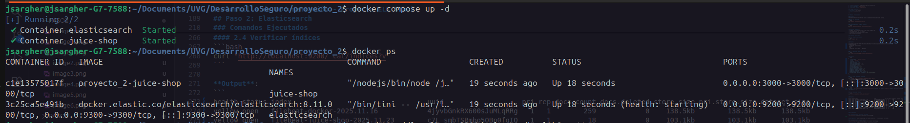

**Descripción**: Docker compose ps mostrando juice-shop y elasticsearch corriendo.

#### Screenshot 2.2: Cluster Health


**Descripción**: JSON mostrando estado "green" del cluster.

#### Screenshot 2.3: Documento Creado
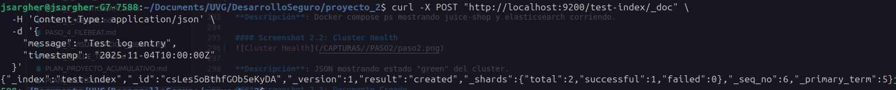

**Descripción**: Respuesta exitosa de creación de documento.

#### Screenshot 2.4: Índices
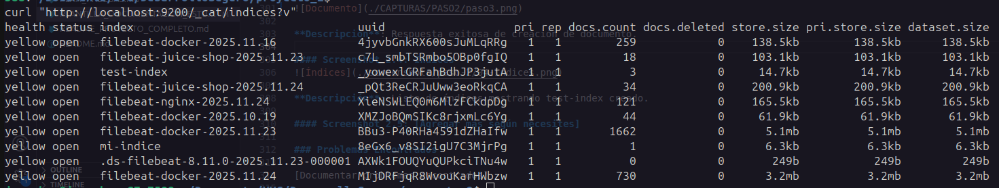

**Descripción**: Lista de índices mostrando test-index creado.

#### Screenshot 2.5: [Agregar más según necesites]
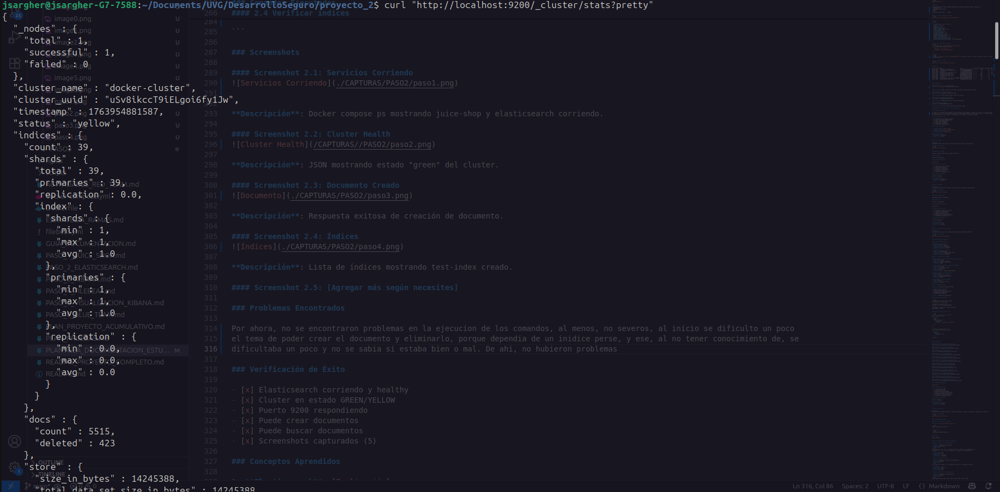

**Descripción**: Métricas generales del cluster (shards, docs, storage).

### Problemas Encontrados

Por ahora, no se encontraron problemas en la ejecucion de los comandos, al menos, no severos, al inicio se dificulto un poco
el tema de poder crear el documento y eliminarlo, porque dependia de un inidice perse, y ese, al no tener conocimiento de, se
dificultaba un poco y no se sabia si estaba bien o mal. De ahi, no hubieron problemas

### Verificación de Éxito

- [x] Elasticsearch corriendo y healthy
- [x] Cluster en estado GREEN/YELLOW
- [x] Puerto 9200 respondiendo
- [x] Puede crear documentos
- [x] Puede buscar documentos
- [x] Screenshots capturados (5)

### Conceptos Aprendidos

1. **Elasticsearch**: 
Motor de búsqueda y análisis distribuido basado en Apache Lucene. Funciona como 
una base de datos NoSQL especializada en almacenar, buscar y analizar grandes 
volúmenes de datos en tiempo real.

**Características principales**:
- Búsqueda full-text extremadamente rápida
- Escalabilidad horizontal (añadir más nodos)
- Almacenamiento de documentos JSON
- API RESTful para todas las operaciones\

2. **Índices y Documentos**:
**Índice**: Colección de documentos con características similares. Es equivalente 
a una "base de datos" o "tabla" en sistemas relacionales. Ejemplo: `logs-2024`, 
`usuarios`, `productos`.

**Documento**: Unidad básica de información en formato JSON que se puede indexar. 
Es equivalente a una "fila" o "registro". Cada documento tiene:
- Un **ID único** (generado automáticamente o especificado)
- **Campos** con datos (key-value pairs)
- **Metadatos** (_index, _id, _version)

3. **RESTful API**:
#### 3. **RESTful API**
Elasticsearch expone todas sus funcionalidades a través de una API REST usando 
HTTP. Esto significa que puedes interactuar con él usando herramientas estándar 
como curl, Postman, o cualquier cliente HTTP.

**Verbos HTTP principales**:
- **GET**: Leer datos (búsquedas, obtener documentos)
- **POST**: Crear documentos (sin ID específico)
- **PUT**: Crear/actualizar con ID específico
- **DELETE**: Eliminar documentos o índices

**Estructura de URLs**:
```
http://localhost:9200/{índice}/{tipo}/{id}
```

**Ejemplos**:
```bash
# GET: Buscar en todos los documentos
GET http://localhost:9200/test-index/_search
```

4. **Cluster Health**:
Estado de salud del cluster de Elasticsearch que indica qué tan bien está 
funcionando el sistema. Se verifica con:
```bash
curl http://localhost:9200/_cluster/health
```
**Estados posibles**:

| Estado | Color | Significado | ¿Es normal? |
|--------|-------|-------------|-------------|
| **GREEN** | 🟢 | Todos los shards primarios y réplicas están asignados | Perfecto |
| **YELLOW** | 🟡 | Todos los shards primarios asignados, pero faltan algunas réplicas | Funcional, pero sin redundancia |
| **RED** | 🔴 | Algunos shards primarios no están asignados | Pérdida de datos |

**Métricas importantes**:
- `number_of_nodes`: Cuántos nodos tiene el cluster
- `active_primary_shards`: Shards primarios activos
- `active_shards`: Total de shards (primarios + réplicas)
- `unassigned_shards`: Shards sin asignar (causa de YELLOW/RED)

**En nuestro caso**:
- Estado: **YELLOW**
- Razón: Solo tenemos 1 nodo, no hay dónde colocar réplicas
- ¿Es problema?: No para desarrollo, sí para producción

### Tiempo Invertido
- **Estimado**: 45 minutos
- **Real**: 10 minutos

---

## Paso 3: Kibana

### Objetivo
Implementar Kibana como interfaz visual para explorar datos en Elasticsearch.

### Rama Git Utilizada
```bash
git checkout paso-3-kibana
```

### Comandos Ejecutados

#### 2 Levantar contenedaor
```bash
docker compose up -d
```

**Output**:
```
jsargher@jsargher-G7-7588:~/Documents/UVG/DesarrolloSeguro/proyecto_2$ docker compose up -d
[+] Running 3/3
 ✔ Container elasticsearch  Healthy                                                                                                                                                0.6s 
 ✔ Container juice-shop     Running                                                                                                                                                0.0s 
 ✔ Container kibana         Started   
```

#### 2.1 Ver logs de inicio de Kibana
```bash
docker compose logs -f kibana
```

**Output**:
```
kibana  | Kibana is currently running with legacy OpenSSL providers enabled! For details and instructions on how to disable see https://www.elastic.co/guide/en/kibana/8.11/production.html#openssl-legacy-provider
kibana  | {"log.level":"info","@timestamp":"2025-11-24T03:39:29.246Z","log":{"logger":"elastic-apm-node"},"agentVersion":"4.0.0","env":{"pid":7,"proctitle":"/usr/share/kibana/bin/../node/bin/node","os":"linux 6.14.0-35-generic","arch":"x64","host":"990dacde1431","timezone":"UTC+00","runtime":"Node.js v18.18.2"},"config":{"serviceName":{"source":"start","value":"kibana","commonName":"service_name"},"serviceVersion":{"source":"start","value":"8.11.0","commonName":"service_version"},"serverUrl":{"source":"start","value":"https://kibana-cloud-apm.apm.us-east-1.aws.found.io/","commonName":"server_url"},"logLevel":{"source":"default","value":"info","commonName":"log_level"},"active":{"source":"start","value":true},"contextPropagationOnly":{"source":"start","value":true},"environment":{"source":"start","value":"production"},"globalLabels":{"source":"start","value":[["git_rev","f2ea0c43ec0d854259d63d926b97e5c556b5f6b2"]],"sourceValue":{"git_rev":"f2ea0c43ec0d854259d63d926b97e5c556b5f6b2"}},"secretToken":{"source":"start","value":"[REDACTED]","commonName":"secret_token"},"breakdownMetrics":{"source":"start","value":false},"captureSpanStackTraces":{"source":"start","sourceValue":false},"centralConfig":{"source":"start","value":false},"metricsInterval":{"source":"start","value":120,"sourceValue":"120s"},"propagateTracestate":{"source":"start","value":true},"transactionSampleRate":{"source":"start","value":0.1,"commonName":"transaction_sample_rate"},"captureBody":{"source":"start","value":"off","commonName":"capture_body"},"captureHeaders":{"source":"start","value":false}},"activationMethod":"require","ecs":{"version":"1.6.0"},"message":"Elastic APM Node.js Agent v4.0.0"}
kibana  | [2025-11-24T03:39:30.781+00:00][INFO ][root] Kibana is starting...```
```

#### 2.2 Verificar estado de Kibana
```bash
curl http://localhost:5601/api/status
```

**Output**:
```
{"name":"990dacde1431","uuid":"70a628cf-c00a-4aa2-a390-2c4a5ada114f","version":{"number":"8.11.0","build_hash":"f2ea0c43ec0d854259d63d926b97e5c556b5f6b2","build_number":68160,"build_snapshot":false,"build_date":"2023-11-04T11:05:45.363Z"},"status":{"overall":{"level":"available","summary":"All services are available"},"core":{"elasticsearch":{"level":"available","summary":"Elasticsearch is available","meta":{"warningNodes":[],"incompatibleNodes":[]}},"savedObjects":{"level":"available","summary":"SavedObjects service has completed migrations and is available","meta":{"migratedIndices":{"migrated":0,"skipped":0,"patched":6}}}},"plugins":{"licensing":{"level":"available","summary":"License fetched"},"banners":{"level":"available","summary":"All dependencies are available"},"customBranding":{"level":"available","summary":"All dependencies are available"},"features":{"level":"available","summary":"All dependencies are available"},"globalSearch":{"level":"available","summary":"All dependencies are available"},"mapsEms":{"level":"available","summary":"All dependencies are available"},"globalSearchProviders":{"level":"available","summary":"All dependencies are available"},"guidedOnboarding":{"level":"available","summary":"All dependencies are available"},"home":{"level":"available","summary":"All dependencies are available"},"console":{"level":"available","summary":"All dependencies are available"},"grokdebugger":{"level":"available","summary":"All dependencies are available"},"management":{"level":"available","summary":"All dependencies are available"},"painlessLab":{"level":"available","summary":"All dependencies are available"},"searchprofiler":{"level":"available","summary":"All dependencies are available"},"advancedSettings":{"level":"available","summary":"All dependencies are available"},"cloudDataMigration":{"level":"available","summary":"All dependencies are available"},"spaces":{"level":"available","summary":"All dependencies are available"},"eventLog":{"level":"available","summary":"All dependencies are available"},"security":{"level":"available","summary":"All dependencies are available"},"cloudLinks":{"level":"available","summary":"All dependencies are available"},"data":{"level":"available","summary":"All dependencies are available"},"encryptedSavedObjects":{"level":"available","summary":"All dependencies are available"},"files":{"level":"available","summary":"All dependencies are available"},"lists":{"level":"available","summary":"All dependencies are available"},"snapshotRestore":{"level":"available","summary":"All dependencies are available"},"telemetry":{"level":"available","summary":"All dependencies are available"},"actions":{"level":"available","summary":"All dependencies are available"},"apmDataAccess":{"level":"available","summary":"All dependencies are available"},"charts":{"level":"available","summary":"All dependencies are available"},"dataViewEditor":{"level":"available","summary":"All dependencies are available"},"dataViewFieldEditor":{"level":"available","summary":"All dependencies are available"},"ecsDataQualityDashboard":{"level":"available","summar...```
```

#### 2.3 Verificar índices desde la perspectiva de Kibana
```bash
curl http://localhost:5601/api/index_management/indices
```

**Output**:
```
[{"name":".apm-agent-configuration","primary":"1","replica":"0","isFrozen":false,"aliases":"none","hidden":true,"health":"green","status":"open","uuid":"6ipGp6j9Q2e6kWJE93JTnQ","documents":0,"documents_deleted":0,"size":"249b","primary_size":"249b","isRollupIndex":false,"ilm":{},"isFollowerIndex":false},{"name":".apm-custom-link","primary":"1","replica":"0","isFrozen":false,"aliases":"none","hidden":true,"health":"green","status":"open","uuid":"ntFhBi4HT66TtFZFrgjICg","documents":0,"documents_deleted":0,"size":"249b","primary_size":"249b","isRollupIndex":false,"ilm":{},"isFollowerIndex":false},{"name":".apm-source-map","primary":"1","replica":"0","isFrozen":false,"aliases":"none","hidden":true,"health":"green","status":"open","uuid":"L6kNcDmjSwKlWfuT0BQRMA","documents":0,"documents_deleted":0,"size":"249b","primary_size":"249b","isRollupIndex":false,"ilm":{},"isFollowerIndex":false},{"name":".async-search","primary":"1","replica":"0","isFrozen":false,"aliases":"none","hidden":true,"health":"green","status":"open","uuid":"U5TDTrRcSnaxiYgD4U2PyQ","documents":70,"documents_deleted":10,"size":"1003.98kb","primary_size":"1003.98kb","isRollupIndex":false,"ilm":{},"isFollowerIndex":false},{"name":".ds-.kibana-event-log-ds-2025.11.23-000001","primary":"1","replica":"0","isFrozen":false,"aliases":"none","hidden":true,"data_stream":".kibana-event-log-ds","health":"green","status":"open","uuid":"73_j2gzsRuOsh074f2cb_g","documents":4,"documents_deleted":0,"size":"24.4kb","primary_size":"24.4kb","isRollupIndex":false,"ilm":{},"isFollowerIndex":false},{"name":".ds-.logs-deprecation.elasticsearch-default-2025.11.23-000001","primary":"1","replica":"0","isFrozen":false,"aliases":"none","hidden":true,"data_stream":".logs-deprecation.elasticsearch-default","health":"green","status":"open","uuid":"Yvw3VioqSV6vQM8KqVd7dw","documents":2,"documents_deleted":0,"size":"24.63kb","primary_size":"24.63kb","isRollupIndex":false,"ilm":{},"isFollowerIndex":false},{"name":".ds-filebeat-8.11.0-2025.11.23-000001","primary":"1","replica":"1","isFrozen":false,"aliases":"none","hidden":true,"data_stream":"filebeat-8.11.0","health":"yellow","status":"open","uuid":"AXWk1FOUQYuQUPkciTNu4w","documents":0,"documents_deleted":0,"size":"249b","primary_size":"249b","isRollupIndex":false,"ilm":{"index":".ds-filebeat-8.11.0-2025.11.23-000001","managed":true,"policy":"filebeat","index_creation_date_millis":1763920299965,"time_since_index_creation":"10.07h","lifecycle_date_millis":1763920299965,"age":"10.07h","phase":"hot","phase_time_millis":1763920300057,"action":"rollover","action_time_millis":1763920300257,"step":"check-rollover-ready","step_time_millis":1763920300257,"phase_execution":{"policy":"filebeat","phase_definition":{"min_age":"0ms","actions":{"rollover":{"max_age":"30d","max_primary_shard_size":"50gb"}}},"version":1,"modified_date_in_millis":1763920298756}},"isFollowerIndex":false},{"name":".ds-ilm-history-5-2025.11.23-000001...
```

#### 2.3 Visitar interfaz 
```bash
http://localhost:5601
```

### Screenshots

#### Screenshot 2.1: Servicios Corriendo
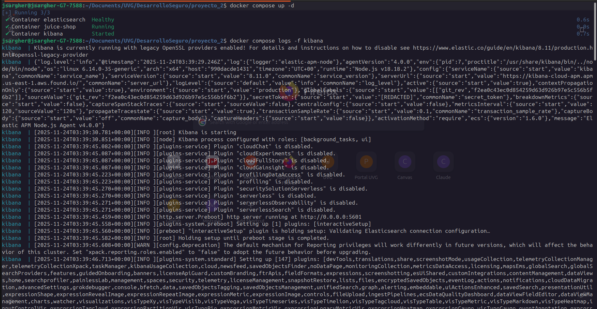

**Descripción**: Docker compose ps mostrando kibana corriendo.

#### Screenshot 2.2: Cluster Status
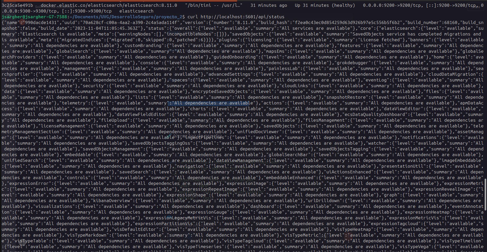

**Descripción**: JSON mostrando el estado de Kibana y su conexión con Elasticsearch.

#### Screenshot 2.3: Kibana consultando Elasticsearch
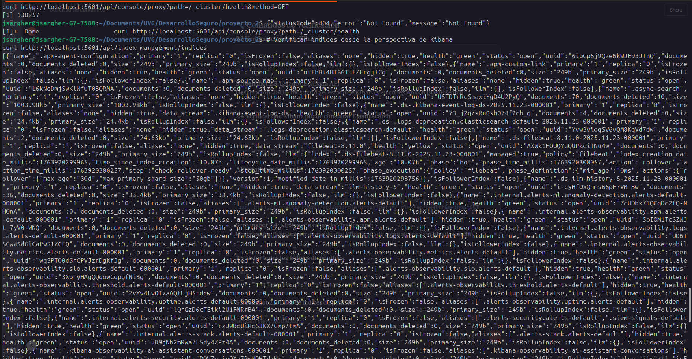

**Descripción**: Respuesta mostrando que Kibana puede comunicarse con Elasticsearch.

#### Screenshot 2.4: Cluster Status
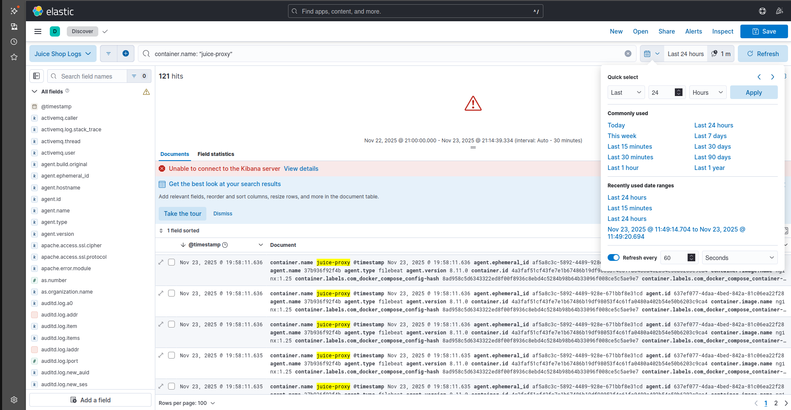

**Descripción**: Logs desde Kibana.

#### Screenshot 2.5: Dev Tools
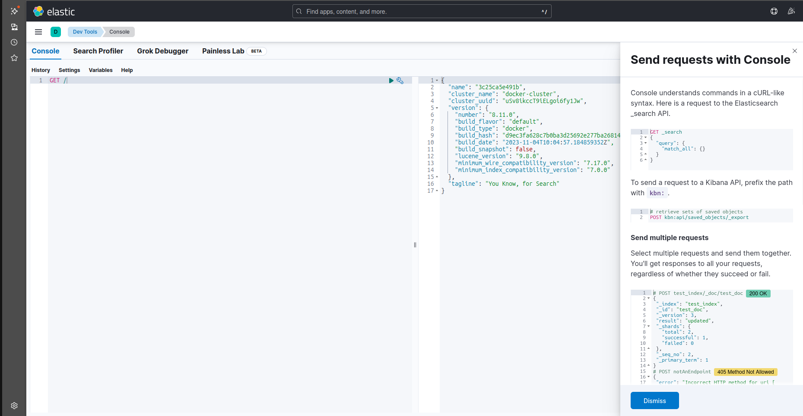

**Descripción**: Usabilida con Dev Tools.

### Problemas Encontrados

[Documentar]

### Verificación de Éxito

- [x] Kibana corriendo y healthy
- [x] Puerto 5601 accesible
- [x] Interfaz web funcional
- [x] Conectado a Elasticsearch
- [x] Dev Tools funcional
- [x] Screenshots capturados (4)

### Conceptos Aprendidos

#### 1. **Arquitectura ELK: Separación de Responsabilidades**
- **Elasticsearch**: Motor de búsqueda y almacenamiento (Backend)
- **Kibana**: Interfaz de visualización (Frontend)
- **Analogía**: Elasticsearch = MySQL, Kibana = phpMyAdmin

#### 2. **Docker Networking: DNS Interno**
**Concepto clave**: Contenedores en la misma red se comunican por nombre de servicio.

**Configuración crítica**:
```yaml
ELASTICSEARCH_HOSTS=http://elasticsearch:9200
```

**¿Por qué "elasticsearch" y no "localhost"?**
- Cada contenedor tiene su propio "localhost"
- Docker DNS resuelve "elasticsearch" → IP del contenedor de Elasticsearch
- Si Kibana usara "localhost:9200", buscaría en su propio contenedor (error)

**Comprobado**:
```bash
# Desde tu máquina
curl http://localhost:9200  Funciona

# Desde contenedor Kibana (internamente)
curl http://localhost:9200      No funciona
curl http://elasticsearch:9200  Funciona
```

---

#### 3. **Healthchecks y Orquestación de Servicios**
**Problema sin healthcheck**:
```
t=0s:  Elasticsearch y Kibana inician simultáneamente
t=5s:  Kibana intenta conectar a Elasticsearch → ERROR (aún no está listo)
t=10s: Kibana se reinicia (retry)
t=30s: Elasticsearch finalmente listo
t=35s: Kibana conecta exitosamente
```

**Solución con `depends_on` + `condition: service_healthy`**:
```yaml
depends_on:
  elasticsearch:
    condition: service_healthy
```

**Resultado**:
```
t=0s:  Solo Elasticsearch inicia
t=30s: Healthcheck de Elasticsearch pasa (HEALTHY)
t=30s: Ahora Kibana inicia
t=35s: Kibana conecta a la primera (sin reintentos)
```

**Beneficios**:
- Menos reintentos y errores
- Logs más limpios
- Inicio más predecible

### Tiempo Invertido
- **Estimado**: 45 minutos
- **Real**: 25 minutos

---

## Paso 4: Filebeat

### Objetivo
Implementar Filebeat para recolectar logs de Docker y enviarlos a Elasticsearch.

### Rama Git Utilizada
```bash
git checkout paso-4-filebeat
```


### Comandos Ejecutados

#### 2.1 Levantar los servicios
```bash
docker compose logs filebeat | head -30
```

**Output**:
```
[+] Running 4/4
 ✔ Container juice-shop     Running                                                                                                                                                0.0s 
 ✔ Container elasticsearch  Healthy                                                                                                                                                0.5s 
 ✔ Container filebeat       Running                                                                                                                                                0.0s 
 ✔ Container kibana         Running   

```

#### 2.2 Verificar que Filebeat inició
```bash
docker compose logs filebeat | grep -i "elasticsearch\|kibana\|pipeline"
```

**Output**:
```
filebeat  | {"log.level":"info","@timestamp":"2025-11-25T02:48:08.900Z","log.logger":"esclientleg","log.origin":{"file.name":"eslegclient/connection.go","file.line":122},"message":"elasticsearch url: http://elasticsearch:9200","service.name":"filebeat","ecs.version":"1.6.0"}
filebeat  | {"log.level":"info","@timestamp":"2025-11-25T02:48:08.901Z","log.logger":"publisher","log.origin":{"file.name":"pipeline/module.go","file.line":105},"message":"Beat name: ba7dbee50138","service.name":"filebeat","ecs.version":"1.6.0"}
filebeat  | {"log.level":"info","@timestamp":"2025-11-25T02:48:08.904Z","log.logger":"kibana","log.origin":{"file.name":"kibana/client.go","file.line":183},"message":"Kibana url: http://kibana:5601","service.name":"filebeat","ecs.version":"1.6.0"}
filebeat  | {"log.level":"info","@timestamp":"2025-11-25T02:48:10.260Z","log.logger":"kibana","log.origin":{"file.name":"kibana/client.go","file.line":183},"message":"Kibana url: http://kibana:5601","service.name":"filebeat","ecs.version":"1.6.0"}
filebeat  | {"log.level":"info","@timestamp":"2025-11-25T02:48:38.914Z","log.logger":"monitoring","log.origin":{"file.name":"log/log.go","file.line":187},"message":"Non-zero metrics in the last 30s","service.name":"filebeat","monitoring":{"metrics":{"beat":{"cgroup":{"cpu":{"id":"/"},"memory":{"id":"/","mem":{"usage":{"bytes":179027968}}}},"cpu":{"system":{"ticks":140,"time":{"ms":140}},"total":{"ticks":1970,"time":{"ms":1970},"value":1970},"user":{"ticks":1830,"time":{"ms":1830}}},"handles":{"limit":{"hard":1048576,"soft":1048576},"open":11},"info":{"ephemeral_id":"9684cd3e-598c-4c23-838a-f18d1828810b","name":"filebeat","uptime":{"ms":30085},"version":"8.11.0"},"memstats":{"gc_next":56580104,"memory_alloc":43070144,"memory_sys":158059816,"memory_total":509823664,"rss":146305024},"runtime":{"goroutines":21}},"filebeat":{"harvester":{"open_files":0,"running":0}},"libbeat":{"config":{"module":{"running":0}},"output":{"events":{"active":0},"type":"elasticsearch"},"pipeline":{"clients":0,"events":{"active":0},"queue":{"max_events":4096}}},"registrar":{"states":{"current":0}},"system":{"cpu":{"cores":12},"load":{"1":1.19,"15":1.27,"5":1.43,"norm":{"1":0.0992,"15":0.1058,"5":0.1192}}}},"ecs.version":"1.6.0"}}...
```

#### 2.3 Ver el estado de los contenedores
```bash
docker compose ps
```

**Output**:
```
NAME            IMAGE                                                  COMMAND                  SERVICE         CREATED          STATUS                 PORTS
elasticsearch   docker.elastic.co/elasticsearch/elasticsearch:8.11.0   "/bin/tini -- /usr/l…"   elasticsearch   24 hours ago     Up 9 hours (healthy)   0.0.0.0:9200->9200/tcp, [::]:9200->9200/tcp, 0.0.0.0:9300->9300/tcp, [::]:9300->9300/tcp
filebeat        docker.elastic.co/beats/filebeat:8.11.0                "/usr/bin/tini -- /u…"   filebeat        30 minutes ago   Up 30 minutes          
juice-shop      proyecto_2-juice-shop                                  "/nodejs/bin/node /j…"   juice-shop      24 hours ago     Up 9 hours             0.0.0.0:3000->3000/tcp, [::]:3000->3000/tcp
kibana          docker.elastic.co/kibana/kibana:8.11.0                 "/bin/tini -- /usr/l…"   kibana          24 hours ago     Up 9 hours (healthy)   0.0.0.0:5601->5601/tcp, [::]:5601->5601/tcp
```


#### 2.4 Generar tráfico en Juice Shop (para crear logs)
```bash
for i in {1..10}; do
  curl -s http://localhost:3000 > /dev/null
  echo "Request $i"
  sleep 1
done
```

**Output**:
```
Request 1
Request 2
Request 3
Request 4
Request 5
Request 6
Request 7
Request 8
Request 9
Request 10
```

#### 2.5 Esperar procesamiento
```bash
sleep 30
```

**Output**:
```
No pasa nada, solo espera
```

#### 2.6 Verificar índices creados
```bash
curl 'http://localhost:9200/_cat/indices?v'
```

**Output**:
```
health status index                                 uuid                   pri rep docs.count docs.deleted store.size pri.store.size dataset.size
yellow open   filebeat-docker-2025.11.16            4jyvbGnkRX600sJuMLqRRg   1   1        259            0    138.5kb        138.5kb      138.5kb
yellow open   filebeat-juice-shop-2025.11.23        c7L_smbTSRmbo5OBp0fgIQ   1   1         18            0    103.1kb        103.1kb      103.1kb
yellow open   test-index                            _yowexlGRFahBdhJP3jutA   1   1          4            0     19.6kb         19.6kb       19.6kb
yellow open   filebeat-juice-shop-2025.11.24        _pQt3ReCRJuUww3eoRkqCA   1   1         70            0    314.6kb        314.6kb      314.6kb
yellow open   filebeat-nginx-2025.11.24             XieNSWLEQ0m6MlzFCkdpDg   1   1        121            0    165.5kb        165.5kb      165.5kb
yellow open   filebeat-docker-2025.10.19            XMZJoBQmSIKc8rjxmLc6Yg   1   1         44            0     61.9kb         61.9kb       61.9kb
yellow open   mi-indice                             8eGx6_v8SI2igU7C3MjrPg   1   1          1            0      6.3kb          6.3kb        6.3kb
yellow open   filebeat-docker-2025.11.23            BBu3-P40RHa4591dZHaIfw   1   1       1662            0      5.1mb          5.1mb        5.1mb
yellow open   .ds-filebeat-8.11.0-2025.11.23-000001 AXWk1FOUQYuQUPkciTNu4w   1   1          0            0       249b           249b         249b
yellow open   filebeat-docker-2025.11.24            MIjDRFjqR8WvouKarHWbzw   1   1       1403            0        4mb            4mb          4mb
yellow open   filebeat-docker-2025.11.25            36lvsjoFTvOcU-cHGprekQ   1   1        402            0      1.6mb          1.6mb        1.6mb
```

#### 2.7 Ver un log específico
```bash
curl -X GET "http://localhost:9200/filebeat-juice-shop-*/_search?size=1&pretty"
```

**Output**:
```
{
  "took" : 3,
  "timed_out" : false,
  "_shards" : {
    "total" : 2,
    "successful" : 2,
    "skipped" : 0,
    "failed" : 0
  },
  "hits" : {
    "total" : {
      "value" : 88,
      "relation" : "eq"
    },
    "max_score" : 1.0,
    "hits" : [
      {
        "_index" : "filebeat-juice-shop-2025.11.23",
        "_id" : "MaHXsZoBJv96vtqJzk4K",
        "_score" : 1.0,
        "_source" : {
          "@timestamp" : "2025-11-23T17:49:15.826Z",
          "message" : "info: Port 3000 is available (OK)",
          "input" : {
            "type" : "container"
          },
          "container" : {
            "id" : "3be40ab1bfcd416430e896aa5118bd4f1ef6ef45c5360a5f18098dee7b7c00e2",
            "image" : {
              "name" : "proyecto_2-juice-shop"
            },
            "name" : "juice-shop",
            "labels" : {
...
```


#### 2.8 Verificar logs de Filebeat en detalle
```bash
docker compose logs filebeat --tail=50
```

**Output**:
```
filebeat  | {"log.level":"info","@timestamp":"2025-11-25T03:02:08.905Z","log.logger":"monitoring","log.origin":{"file.name":"log/log.go","file.line":187},"message":"Non-zero metrics in the last 30s","service.name":"filebeat","monitoring":{"metrics":{"beat":{"cgroup":{"memory":{"mem":{"usage":{"bytes":173268992}}}},"cpu":{"system":{"ticks":550,"time":{"ms":20}},"total":{"ticks":4110,"time":{"ms":80},"value":4110},"user":{"ticks":3560,"time":{"ms":60}}},"handles":{"limit":{"hard":1048576,"soft":1048576},"open":13},"info":{"ephemeral_id":"9684cd3e-598c-4c23-838a-f18d1828810b","uptime":{"ms":840082},"version":"8.11.0"},"memstats":{"gc_next":57906104,"memory_alloc":29090304,"memory_total":663320776,"rss":130048000},"runtime":{"goroutines":43}},"filebeat":{"events":{"active":0,"added":1,"done":1},"harvester":{"open_files":1,"running":1}},"libbeat":{"config":{"module":{"running":0}},"output":{"events":{"acked":1,"active":0,"batches":1,"total":1},"read":{"bytes":205},"write":{"bytes":2718}},"pipeline":{"clients":1,"events":{"active":0,"published":1,"total":1},"queue":{"acked":1}}},"registrar":{"states":{"current":4,"update":1},"writes":{"success":1,"total":1}},"system":{"load":{"1":0.99,"15":1.33,"5":1.27,"norm":{"1":0.0825,"15":0.1108,"5":0.1058}}}},"ecs.version":"1.6.0"}}
filebeat  | {"log.level":"info","@timestamp":"2025-11-25T03:02:38.916Z","log.logger":"monitoring","log.origin":{"file.name":"log/log.go","file.line":187},"message":"Non-zero metrics in the last 30s","service.name":"filebeat","monitoring":{"metrics":{"beat":{"cgroup":{"memory":{"mem":{"usage":{"bytes":173010944}}}},"cpu":{"system":{"ticks":550},"total":{"ticks":4130,"time":{"ms":20},"value":4130},"user":{"ticks":3580,"time":{"ms":20}}},"handles":{"limit":{"hard":1048576,"soft":1048576},"open":13},"info":{"ephemeral_id":"9684cd3e-598c-4c23-838a-f18d1828810b","uptime":{"ms":870084},"version":"8.11.0"},"memstats":{"gc_next":57906104,"memory_alloc":29851576,"memory_total":664082048,"rss":130105344},"runtime":{"goroutines":43}},"filebeat":{"events":{"active":0,"added":1,"done":1},"harvester":{"open_files":1,"running":1}},"libbeat":{"config":{"module":{"running":0}},"output":{"events":{"acked":1,"active":0,"batches":1,"total":1},"read":{"bytes":205},"write":{"bytes":2712}},"pipeline":{"clients":1,"events":{"active":0,"published":1,"total":1},"queue":{"acked":1}}},"registrar":{"states":{"current":4,"update":1},"writes":{"success":1,"total":1}},"system":{"load":{"1":1.43,"15":1.35,"5":1.35,"norm":{"1":0.1192,"15":0.1125,"5":0.1125}}}},"ecs.version":"1.6.0"}}...
```

### Screenshots


#### Screenshot 2.1: Cluster Status
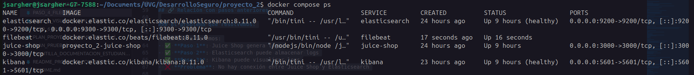

**Descripción**: Filebeat levantado

#### Screenshot 2.2: Filebeat Conectado
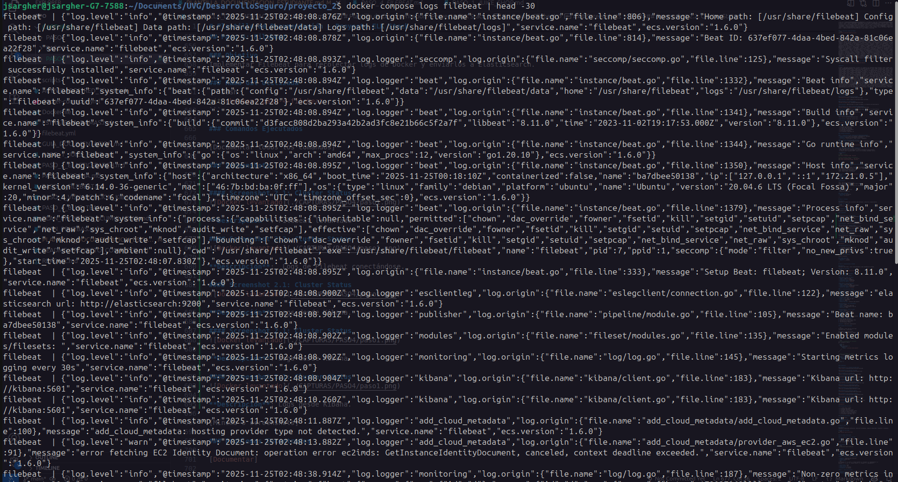

**Descripción**:  Logs de Filebeat conectándose.

#### Screenshot 2.3: 
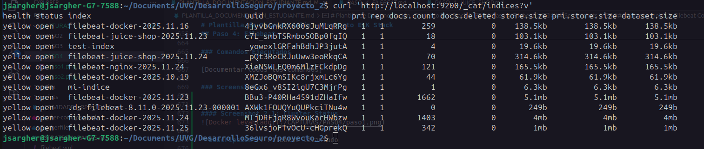

**Descripción**: Índices creados en Elasticsearch

#### Screenshot 2.4: Cluster Status
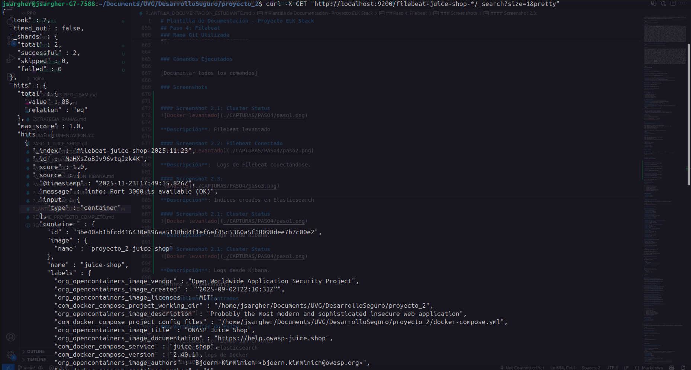

**Descripción**: Documento de ejemplo con metadata.

#### Screenshot 2.5: Cluster Status
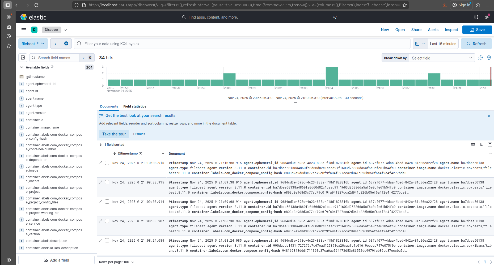

**Descripción**: Discover con logs de Filebeat

### Problemas Encontrados

Ninguno. Todos los servicios iniciaron correctamente y Filebeat se conectó a Elasticsearch sin inconvenientes. Los índices se crearon automáticamente y los logs se están recolectando según lo esperado.

### Verificación de Éxito

- [x] Filebeat corriendo sin errores
- [x] Conectado a Elasticsearch
- [x] Leyendo logs de Docker
- [x] Índices filebeat-* creados
- [x] Documentos con metadata completa
- [x] Screenshots capturados (5)

### Conceptos Aprendidos

1. Filebeat - El conector del stack ELK

- Shipper ligero (~10-50MB RAM) diseñado específicamente para logs
- Parte de la familia Beats (Filebeat, Metricbeat, Packetbeat, etc.)
- Conecta aplicaciones con Elasticsearch sin modificar código

2. Registry de Filebeat

- Archivo que registra qué logs ya fueron leídos y hasta dónde
- Previene duplicados y pérdida de datos
- Permite reanudar procesamiento después de reinicios

3. Procesadores (Processors)

- add_docker_metadata: Enriquece logs con info del contenedor (nombre, ID, imagen)
- decode_json_fields: Parsea campos JSON del mensaje
- add_host_metadata: Agrega información del host (OS, IP)

4. Índices dinámicos

- Filebeat crea índices diferentes según condiciones
- Ejemplo: filebeat-juice-shop-2025.11.24 vs filebeat-docker-2025.11.24
- Facilita búsquedas y mantenimiento de logs

### Tiempo Invertido
- **Estimado**: 1 hora
- **Real**: 30 minutos

---

## Paso 5: Visualización en Kibana

### Objetivo
Configurar Data Views, crear visualizaciones y armar dashboards en Kibana.

### Rama Git Utilizada
```bash
git checkout paso-5-visualizacion
```

### Configuraciones Realizadas

#### 5.1 Data Views Creados

**Data View 1: Todos los Logs**
- **Name**: Todos los Logs
- **Index pattern**: filebeat-*
- **Timestamp field**: @timestamp
- **Número de campos**: [número]

**Data View 2: Juice Shop Logs**
- **Name**: Juice Shop Logs
- **Index pattern**: filebeat-juice-shop-*
- **Timestamp field**: @timestamp
- **Número de campos**: [número]

#### 5.2 Visualizaciones Creadas

**Visualización 1: Distribución de Logs por Contenedor**
- **Tipo**: Pie Chart
- **Data view**: Todos los Logs
- **Campo**: container.name.keyword
- **Métrica**: Count

**Visualización 2: Volumen de Logs en el Tiempo**
- **Tipo**: Line Chart
- **Data view**: Todos los Logs
- **Eje X**: @timestamp
- **Eje Y**: Count
- **Break down by**: container.name.keyword

**Visualización 3: Top 10 Mensajes**
- **Tipo**: Table
- **Data view**: Juice Shop Logs
- **Rows**: message.keyword (Top 10)
- **Métrica**: Count

**Visualización 4: Total de Logs**
- **Tipo**: Metric
- **Data view**: Todos los Logs
- **Métrica**: Count

#### 5.3 Dashboard Creado

**Nombre**: Overview de Logs del Sistema

**Visualizaciones incluidas**:
1. Total de Logs (Metric)
2. Distribución por Contenedor (Pie)
3. Volumen en el Tiempo (Line)
4. Top 10 Mensajes (Table)

**Layout**: [Describir organización]

### Búsquedas KQL Utilizadas

```kql
# Búsqueda 1: Solo logs de Juice Shop
container.name: "juice-shop"

# Búsqueda 2: Logs con errores
message: *error* OR message: *ERROR*

# Búsqueda 3: Logs de las últimas 15 minutos
@timestamp >= now-15m
```

### Queries Avanzadas en Dev Tools

```json
// Query 1: Agregación por contenedor
GET /filebeat-*/_search
{
  "size": 0,
  "aggs": {
    "por_contenedor": {
      "terms": {
        "field": "container.name.keyword"
      }
    }
  }
}

// Query 2: Búsqueda con filtro
GET /filebeat-juice-shop-*/_search
{
  "query": {
    "match": {
      "message": "GET"
    }
  },
  "size": 5
}
```

### Screenshots

#### Screenshot 5.1: Creación de Data View
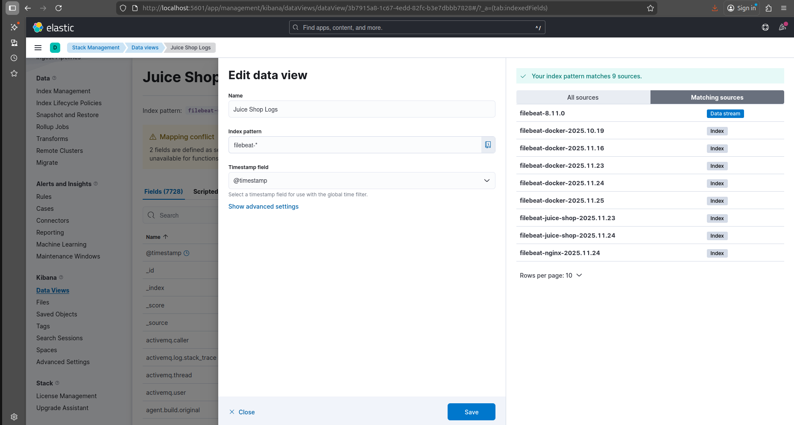


#### Screenshot 5.2: Discover con Logs
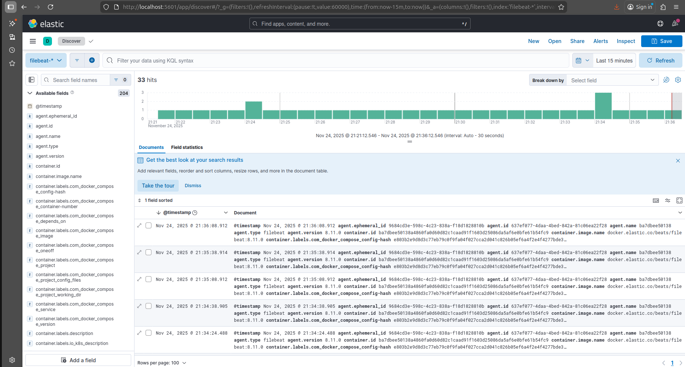

#### Screenshot 5.3: Búsqueda KQL
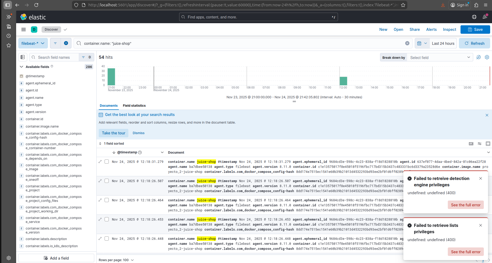

#### Screenshot 5.4: Log Expandido
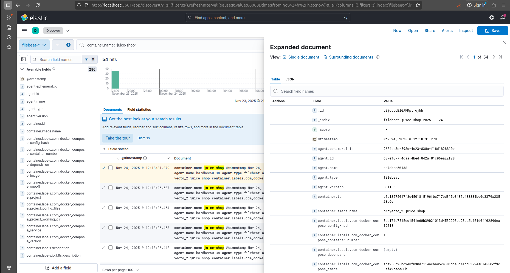

#### Screenshot 5.5: Visualización Pie Chart
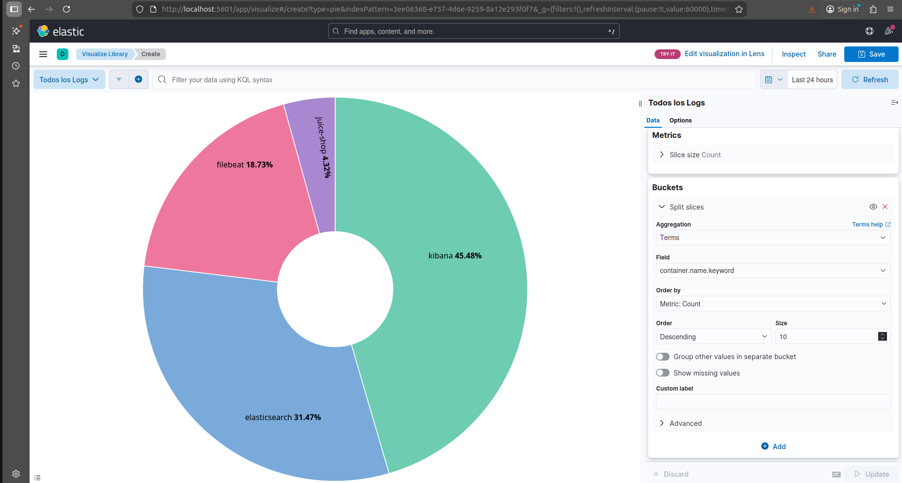

#### Screenshot 5.6: Visualización Line Chart
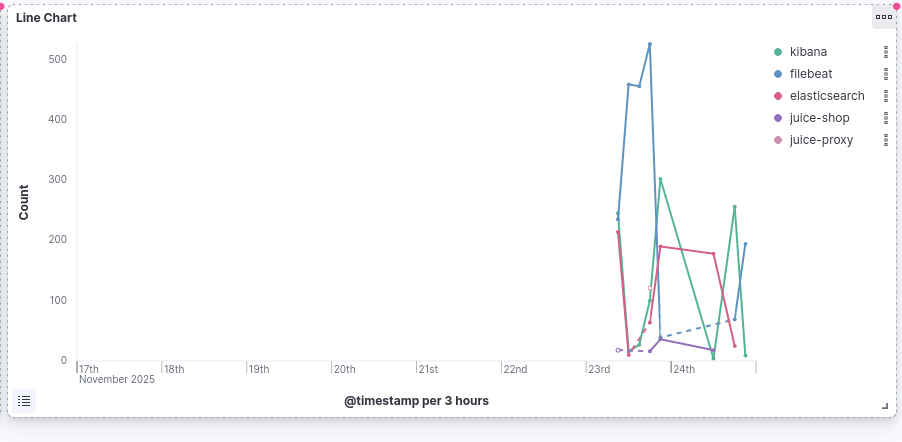

#### Screenshot 5.7: Visualización Table
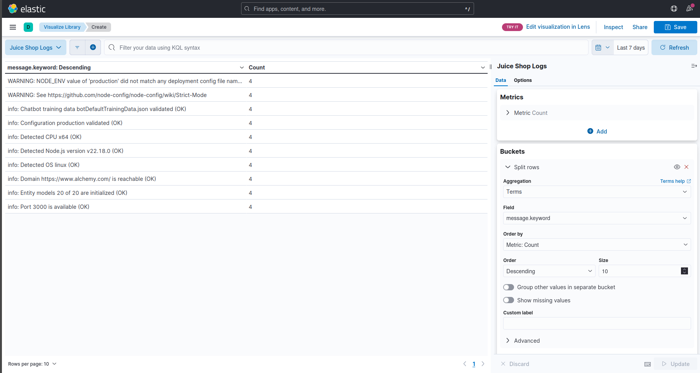

#### Screenshot 5.8: Visualización Metric
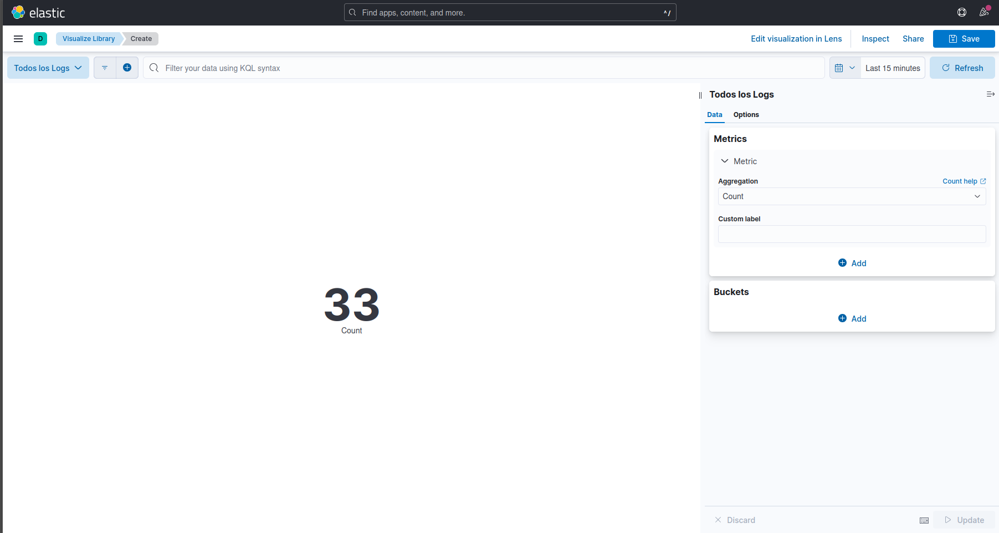

#### Screenshot 5.9: Visualize Library


#### Screenshot 5.10: Dashboard Completo
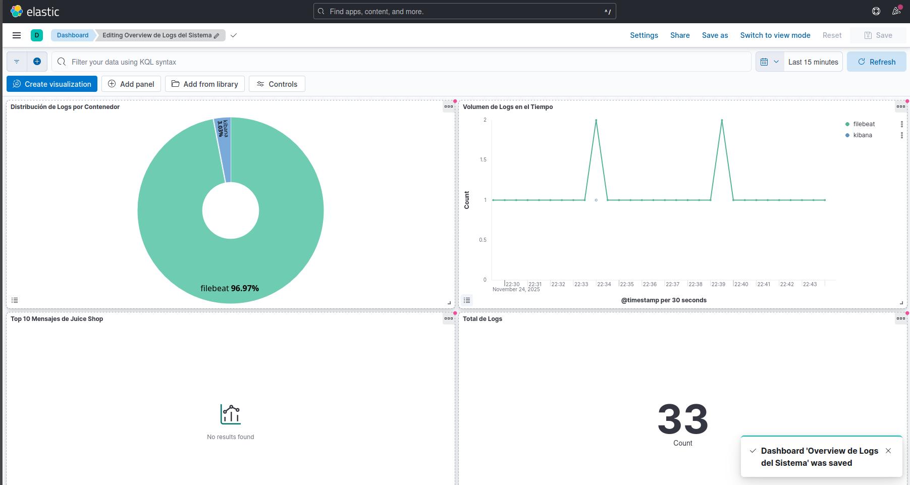

#### Screenshot 5.11: Dev Tools Query
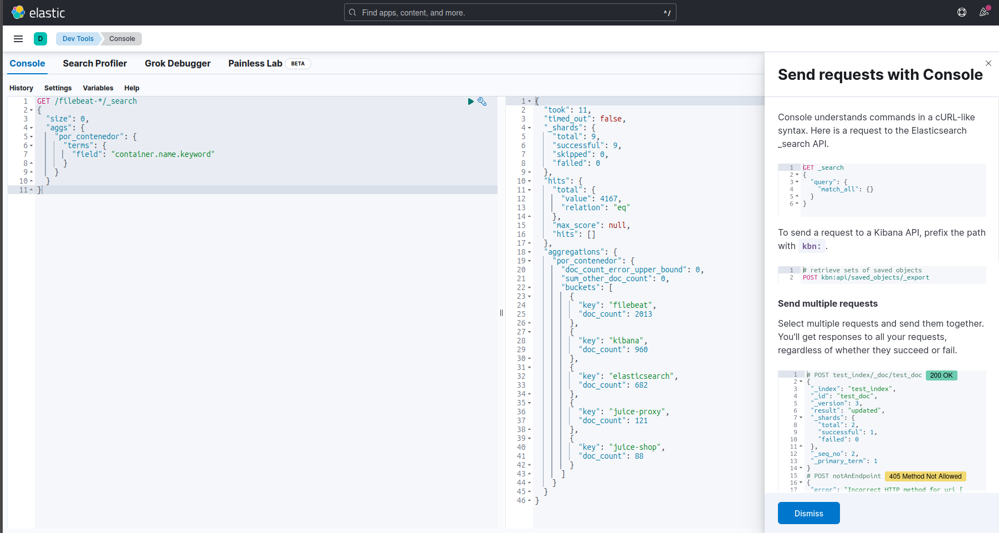

#### Screenshot 5.12: Dashboard Interactivo
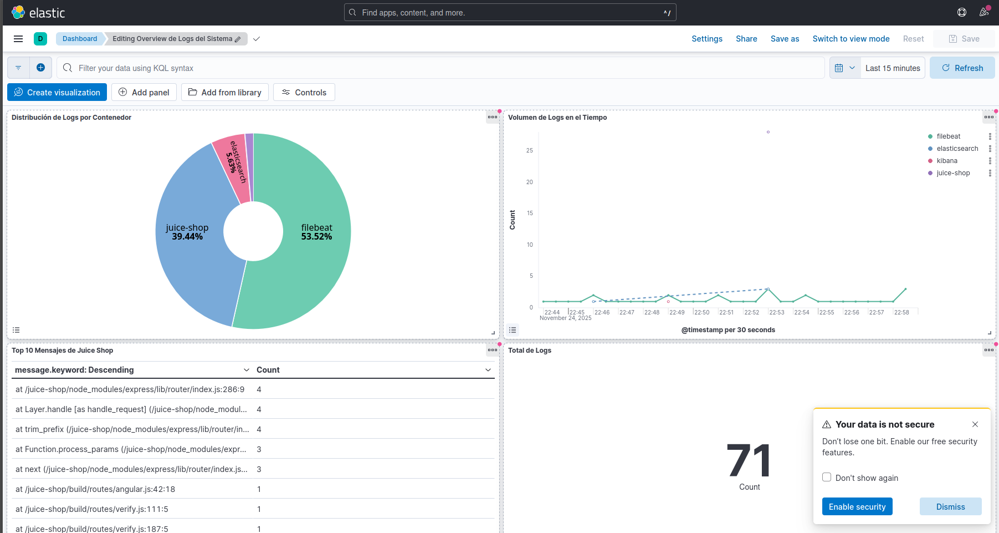
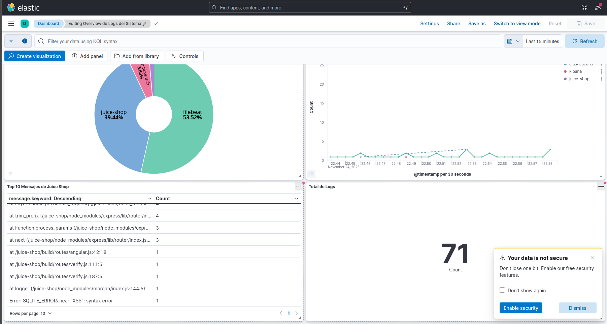

### Problemas Encontrados

Al momento de querer ver el trafico en terminos de ataques, no se puede completar bien.
Se complico un poco el tema de las graficas, pero en terminos de simplemente no conocer
como funciona el sistema como tal

### Verificación de Éxito

- [x] 2 Data Views creados
- [x] Discover funcional
- [x] Búsquedas KQL funcionando
- [x] Mínimo 4 visualizaciones creadas
- [x] Dashboard creado y funcional
- [x] Dev Tools con queries avanzadas
- [x] Screenshots capturados (12)

### Conceptos Aprendidos

#### 1. **Data Views (Index Patterns)**
- Definen qué índices de Elasticsearch son accesibles en Kibana
- Usan wildcards (`*`) para incluir múltiples índices dinámicamente
- Son prerequisito para usar Discover, Visualize y Dashboard
- Reemplazaron el concepto antiguo de "Index Pattern" en versiones modernas de Kibana

#### 2. **Discover - Explorador de logs**
- Interfaz principal para exploración interactiva de logs
- Permite agregar/quitar columnas para personalizar la vista
- Los logs se pueden expandir para ver todos los campos en formato JSON
- Soporta auto-refresh para monitoreo en tiempo real (útil para debugging)

#### 3. **KQL (Kibana Query Language)**
- Lenguaje de consulta simplificado para filtrar logs
- Sintaxis básica: `campo: "valor"` o `campo: *patrón*`
- Operadores lógicos: `AND`, `OR`, `NOT`
- Más intuitivo que Lucene para usuarios no técnicos
- Ejemplo: `container.name: "juice-shop" AND message: *error*`

#### 4. **Tipos de visualizaciones en Kibana**
- **Pie/Bar Chart**: Distribución porcentual o absoluta de categorías
- **Line Chart**: Tendencias y volumen de datos a lo largo del tiempo
- **Data Table**: Lista ordenada de valores con contadores
- **Metric**: KPI mostrado como número grande para monitoreo rápido
- Cada tipo tiene casos de uso específicos según el análisis requerido

#### 5. **Aggregations en Elasticsearch**
- Operaciones de análisis sobre conjuntos de documentos
- **Terms aggregation**: Agrupa por valores únicos (ej: nombres de contenedores)
- **Count**: Cuenta documentos que coinciden con criterios
- **Date histogram**: Agrupa eventos por intervalos de tiempo
- Base de todas las visualizaciones en Kibana

#### 6. **Dashboard interactivo**
- Combina múltiples visualizaciones en una vista unificada
- Los filtros aplicados afectan TODAS las visualizaciones simultáneamente
- Click en cualquier visualización crea filtros que se aplican al resto
- Permite crear vistas personalizadas para diferentes roles (devs, ops, management)

#### 7. **Dev Tools Console**
- Acceso directo a la API REST de Elasticsearch
- Ejecuta queries JSON complejas no disponibles en la UI
- Útil para debugging, análisis avanzado y scripting
- Incluye autocompletado de sintaxis y campos
- Ejemplo de uso: agregaciones complejas, bulk operations

#### 8. **Field types en Elasticsearch**
- **keyword**: Texto exacto sin análisis, para filtros y agregaciones
- **text**: Texto analizado y tokenizado, para búsqueda full-text
- **date**: Timestamps para rangos temporales
- **numeric** (long, float): Para cálculos y rangos numéricos
- La diferencia afecta cómo se pueden usar en visualizaciones

#### 9. **Time range selector**
- Controla el periodo de tiempo visible en todas las vistas
- Opciones: absolute (fechas fijas) o relative (últimas X horas/días)
- Quick selects: Last 15m, 1h, 24h, 7d, 30d, 90d
- Afecta todas las visualizaciones y búsquedas en el contexto actual
- Crítico para análisis histórico vs monitoreo en tiempo real

#### 10. **Visualize Library - Reutilización de componentes**
- Biblioteca centralizada de todas las visualizaciones creadas
- Las visualizaciones son reutilizables en múltiples dashboards
- Se pueden editar desde la biblioteca (cambios se reflejan en todos los dashboards)
- Facilita estandarización y colaboración en equipos
- Permite compartir y versionar visualizaciones

#### 11. **Buckets vs Metrics**
- **Metrics**: Cálculos sobre datos (Count, Sum, Average, etc.)
- **Buckets**: Agrupaciones de documentos (Terms, Date Histogram, Range)
- Las visualizaciones combinan ambos: buckets determinan el eje X, metrics el eje Y
- Ejemplo: "Count (metric) de logs por container.name (bucket)"

#### 12. **Índices con wildcard patterns**
- Patrones como `filebeat-*` permiten consultar múltiples índices simultáneamente
- Útil para índices con rotación diaria: `filebeat-2025.11.23`, `filebeat-2025.11.24`
- Optimiza queries al distribuir carga entre múltiples índices
- Facilita políticas de retención (eliminar índices antiguos por fecha)

### Tiempo Invertido
- **Estimado**: 1.5 horas
- **Real**: 45 minutos

---

## Paso 6: Blue Team

### Objetivo
Implementar operaciones defensivas: detección de amenazas, reglas de seguridad y respuesta a incidentes.

### Rama Git Utilizada
```bash
git checkout paso-6-blue-team
```

### Actividades Realizadas

#### 6.1 Script de Tráfico Legítimo

**Archivo**: `scripts/blue-team-traffic.sh`

```bash
[Pegar contenido del script]
```

**Ejecución**:
```bash
./scripts/blue-team-traffic.sh
```

**Output**:
```
[Pegar output]
```

#### 6.2 Configuración de Reglas de Detección

**Regla 1: Detección de SQL Injection**

- **Nombre**: Detección SQL Injection
- **Tipo**: Custom query
- **Query KQL**:
```kql
url.original:("*' or 1=1*" or "*union select*" or "*sleep(*" or "*benchmark(*") or
message:("*' or 1=1*" or "*union select*" or "*sleep(*" or "*benchmark(*")
```
- **Severidad**: High
- **Risk score**: 75
- **Intervalo**: 5 minutos
- **Lookback**: 15 minutos

**Regla 2: Detección de XSS**

- **Nombre**: Detección Cross-Site Scripting (XSS)
- **Tipo**: Threshold
- **Query KQL**:
```kql
url.original:*"<script*" or url.original:*"onerror="* or message:*"<script*"
```
- **Threshold**: >= 1
- **Group by**: source.ip
- **Severidad**: High
- **Risk score**: 70

**Regla 3: Detección de Scanning/Burst**

- **Nombre**: Detección de Scanning/Burst
- **Tipo**: Threshold
- **Query KQL**:
```kql
http.response.status_code: (400 or 401 or 403 or 404 or 500 or 503)
```
- **Threshold**: >= 20
- **Group by**: source.ip
- **Time window**: 2 minutos
- **Severidad**: Medium
- **Risk score**: 50

#### 6.3 Pruebas de Detección

**Prueba 1: SQL Injection**
```bash
curl "http://localhost:3000/rest/products/search?q=' OR 1=1 --"
```

**Resultado**: [Describir si se detectó]

**Prueba 2: XSS**
```bash
curl "http://localhost:3000/rest/products/search?q=<script>alert(1)</script>"
```

**Resultado**: [Describir si se detectó]

**Prueba 3: Scanning**
```bash
for i in {1..30}; do 
  curl -s -o /dev/null -w "%{http_code}\n" "http://localhost:3000/non-existent-$i"
  sleep 0.5
done
```

**Resultado**: [Describir si se detectó]

#### 6.4 Dashboard de Detecciones

**Nombre**: Blue Team - Detecciones de Seguridad

**Visualizaciones incluidas**:
1. Total de Detecciones (Metric)
2. Detecciones por Tipo (Pie Chart)
3. Timeline de Detecciones (Line Chart)
4. Top IPs Atacantes (Table)
5. Detecciones por Severidad (Bar Chart)

#### 6.5 Análisis de Incidentes

**Incidente 1: SQL Injection Detectado**

- **Fecha/Hora**: [timestamp]
- **IP Origen**: [IP]
- **Endpoint Atacado**: /rest/products/search
- **Payload**: `' OR 1=1 --`
- **Regla Disparada**: Detección SQL Injection
- **Severidad**: High

**Análisis**:
[Descripción del ataque, qué intentaba hacer, qué datos estaban en riesgo]

**Acciones Tomadas**:
1. [Acción 1]
2. [Acción 2]

**Resultado**:
[Qué pasó después de las acciones]

**Incidente 2: XSS Detectado**

[Seguir mismo formato]

**Incidente 3: Scanning Detectado**

[Seguir mismo formato]

#### 6.6 Falsas Alarmas y Limitaciones

**Falsa Alarma 1**: [Descripción]
- **Causa**: [Por qué se disparó]
- **Solución**: [Cómo se ajustó la regla]

**Limitación 1**: [Descripción]
- **Impacto**: [Qué no se puede detectar]
- **Mitigación**: [Cómo se podría mejorar]

#### 6.7 Instrumentación Adicional

**CORS Configuration**: [Si se configuró, documentar]

**Nginx Proxy**: [Si se agregó, documentar configuración]

**Filebeat Processors**: [Documentar processors personalizados]

**Ingest Pipelines**: [Si se crearon, documentar]

### Screenshots

#### Screenshot 6.1: Script de Tráfico


#### Screenshot 6.2: Reglas de Detección


#### Screenshot 6.3: Regla SQLi Detalle


#### Screenshot 6.4: Regla XSS Detalle


#### Screenshot 6.5: Regla Burst Detalle


#### Screenshot 6.6: Ataque SQLi Simulado


#### Screenshot 6.7: Ataque XSS Simulado


#### Screenshot 6.8: Scanning Simulado


#### Screenshot 6.9: Alertas Generadas


#### Screenshot 6.10: Detalle de Alerta


#### Screenshot 6.11: Dashboard de Detecciones


#### Screenshot 6.12: Logs Maliciosos en Discover


### Informe de Respuesta

#### Resumen de Detecciones

| Tipo de Ataque | Cantidad | Severidad | IPs Únicas | Mitigado |
|----------------|----------|-----------|------------|----------|
| SQL Injection | [#] | High | [#] | [Sí/No] |
| XSS | [#] | High | [#] | [Sí/No] |
| Scanning | [#] | Medium | [#] | [Sí/No] |

#### Acciones Defensivas Implementadas

1. **Bloqueo de IPs**: [Describir]
2. **Aumento de Logging**: [Describir]
3. **Alertas Configuradas**: [Describir]
4. **WAF Rules**: [Si aplica]

#### Lecciones Aprendidas

1. [Lección 1]
2. [Lección 2]
3. [Lección 3]

### Verificación de Éxito

- [ ] Script de tráfico legítimo creado
- [ ] 3 reglas de detección configuradas
- [ ] Ataques simulados ejecutados
- [ ] Alertas generadas correctamente
- [ ] Dashboard de detecciones creado
- [ ] Logs maliciosos identificados
- [ ] Informe de respuesta completado
- [ ] Screenshots capturados (12)

### Conceptos Aprendidos

[Listar conceptos]

### Tiempo Invertido
- **Estimado**: 2 horas
- **Real**: ___ minutos

---

## Actividades Red Team

### Objetivo
Identificar y explotar vulnerabilidades en Juice Shop para generar tráfico malicioso que el Blue Team pueda detectar.

### Vulnerabilidades Explotadas

#### Vulnerabilidad 1: SQL Injection en Login

**Descripción Técnica**:
[Explicar qué es SQL Injection y cómo funciona]

**Endpoint Vulnerable**: `/rest/user/login`

**Pasos para Reproducir**:
1. [Paso 1]
2. [Paso 2]
3. [Paso 3]

**Payload Utilizado**:
```bash
curl -X POST http://localhost:3000/rest/user/login \
  -H "Content-Type: application/json" \
  -d '{
    "email": "'\'' OR 1=1--",
    "password": "anything"
  }'
```

**Response Obtenida**:
```json
[Pegar respuesta]
```

**Impacto**:
- **Confidencialidad**: 🔴 CRÍTICO - [Explicar]
- **Integridad**: 🔴 CRÍTICO - [Explicar]
- **Disponibilidad**: 🟡 MEDIO - [Explicar]

**Clasificación**:
- **OWASP Top 10**: A03:2021 - Injection
- **CVSS v3.1**: 9.8 (Critical)
- **Vector**: CVSS:3.1/AV:N/AC:L/PR:N/UI:N/S:U/C:H/I:H/A:H

**Cálculo CVSS**:
- **AV:N** - [Explicar por qué]
- **AC:L** - [Explicar por qué]
- **PR:N** - [Explicar por qué]
- **UI:N** - [Explicar por qué]
- **C:H** - [Explicar por qué]
- **I:H** - [Explicar por qué]
- **A:H** - [Explicar por qué]

**Screenshots**:


**Logs Capturados**:
```
[Extracto de logs de Elasticsearch mostrando el ataque]
```

#### Vulnerabilidad 2: Cross-Site Scripting (XSS)

[Seguir el mismo formato detallado]

#### Vulnerabilidad 3: Broken Authentication

[Seguir el mismo formato detallado]

#### Vulnerabilidad 4: Broken Access Control

[Seguir el mismo formato detallado]

### Coordinación con Blue Team

**Fecha de Ataques**: [Fecha y hora]
**Duración**: [Duración]
**IPs Utilizadas**: [Lista de IPs]
**Endpoints Atacados**: [Lista de endpoints]

**Resultados de Detección**:
| Ataque | Detectado por Blue Team | Tiempo de Detección |
|--------|-------------------------|---------------------|
| SQL Injection | [Sí/No] | [Tiempo] |
| XSS | [Sí/No] | [Tiempo] |
| Auth Bypass | [Sí/No] | [Tiempo] |
| Access Control | [Sí/No] | [Tiempo] |

### Verificación de Éxito

- [ ] Mínimo 4 vulnerabilidades explotadas
- [ ] Cada vulnerabilidad con PoC completo
- [ ] CVSS calculado para cada una
- [ ] OWASP Top 10 clasificación
- [ ] Screenshots de evidencia (mínimo 3 por vulnerabilidad)
- [ ] Logs capturados
- [ ] Impacto documentado

---

## Análisis Técnico

### Arquitectura Completa del Sistema

```
[Dibujar o pegar diagrama de arquitectura]
```

**Componentes**:
1. **Juice Shop**: [Explicar rol]
2. **Docker Engine**: [Explicar rol]
3. **Filebeat**: [Explicar rol]
4. **Elasticsearch**: [Explicar rol]
5. **Kibana**: [Explicar rol]

### Flujo de Datos Detallado

```
Usuario → Juice Shop → Docker Logs → Filebeat → Elasticsearch → Kibana → Analista
```

**Paso a paso**:
1. [Explicar paso 1]
2. [Explicar paso 2]
3. [Explicar paso 3]
...

### Decisiones de Diseño

#### Decisión 1: [Título]
**Contexto**: [Por qué se necesitaba tomar una decisión]
**Opciones Consideradas**: [Opción A, B, C]
**Decisión Tomada**: [Cuál se eligió]
**Justificación**: [Por qué se eligió]
**Resultado**: [Cómo funcionó]

#### Decisión 2: [Título]
[Seguir mismo formato]

---

## Problemas y Soluciones

### Problema 1: [Título del Problema]

**Paso en el que ocurrió**: Paso [número]

**Descripción del Problema**:
[Descripción detallada]

**Error Exacto**:
```
[Mensaje de error completo]
```

**Causa Raíz**:
[Explicar por qué ocurrió]

**Intentos de Solución**:
1. **Intento 1**: [Qué se intentó] - Resultado: [Funcionó/No funcionó]
2. **Intento 2**: [Qué se intentó] - Resultado: [Funcionó/No funcionó]

**Solución Final**:
```bash
[Comandos o pasos que resolvieron el problema]
```

**Verificación**:
[Cómo se verificó que el problema se resolvió]

**Lección Aprendida**:
[Qué se aprendió de este problema]

### Problema 2: [Título]
[Seguir mismo formato]

### Problema 3: [Título]
[Seguir mismo formato]

---

## Conceptos Aprendidos

### 1. Docker y Contenedores

**¿Qué es Docker?**
[Explicación en tus propias palabras]

**¿Por qué es útil?**
[Explicación]

**Conceptos clave aprendidos**:
- Contenedores vs Imágenes
- Port mapping
- Volúmenes
- Redes
- Docker Compose

### 2. Elasticsearch

**¿Qué es Elasticsearch?**
[Explicación]

**¿Cómo funciona?**
[Explicación]

**Conceptos clave aprendidos**:
- Índices y documentos
- Queries y búsquedas
- Agregaciones
- RESTful API
- Cluster health

### 3. Kibana

**¿Qué es Kibana?**
[Explicación]

**Conceptos clave aprendidos**:
- Data Views
- Discover
- Visualizaciones
- Dashboards
- KQL (Kibana Query Language)

### 4. Filebeat

**¿Qué es Filebeat?**
[Explicación]

**Conceptos clave aprendidos**:
- Log shipping
- Processors
- Metadata enrichment
- Registry
- Inputs y outputs

### 5. Seguridad

**Conceptos de Blue Team aprendidos**:
- Detección de amenazas
- Reglas de seguridad
- Análisis de logs
- Respuesta a incidentes
- SIEM (Security Information and Event Management)

**Conceptos de Red Team aprendidos**:
- SQL Injection
- Cross-Site Scripting (XSS)
- Broken Authentication
- Broken Access Control
- OWASP Top 10
- CVSS scoring

### 6. Otros Conceptos

[Listar otros conceptos aprendidos]

---

## Conclusiones

### Logros Principales

1. [Logro 1]
2. [Logro 2]
3. [Logro 3]

### Reflexión Personal

[Escribe 2-3 párrafos sobre tu experiencia con el proyecto:
- ¿Qué fue lo más desafiante?
- ¿Qué fue lo más interesante?
- ¿Cómo te ayudará esto en tu carrera?
- ¿Qué harías diferente la próxima vez?]

### Aplicaciones Prácticas

**En el mundo real, este sistema se podría usar para**:
1. [Aplicación 1]
2. [Aplicación 2]
3. [Aplicación 3]

### Mejoras Futuras

**Si tuviera más tiempo, agregaría**:
1. [Mejora 1]
2. [Mejora 2]
3. [Mejora 3]

### Habilidades Desarrolladas

- [ ] Administración de contenedores Docker
- [ ] Configuración de sistemas de logging
- [ ] Análisis de logs de seguridad
- [ ] Creación de visualizaciones de datos
- [ ] Detección de amenazas
- [ ] Explotación de vulnerabilidades (ético)
- [ ] Documentación técnica
- [ ] Troubleshooting y resolución de problemas

---

## Referencias

### Documentación Oficial
1. [Docker Documentation](https://docs.docker.com/)
2. [Elasticsearch Guide](https://www.elastic.co/guide/en/elasticsearch/reference/current/index.html)
3. [Kibana Guide](https://www.elastic.co/guide/en/kibana/current/index.html)
4. [Filebeat Reference](https://www.elastic.co/guide/en/beats/filebeat/current/index.html)
5. [OWASP Juice Shop](https://owasp.org/www-project-juice-shop/)

### Recursos de Seguridad
1. [OWASP Top 10 2021](https://owasp.org/Top10/)
2. [CVSS Calculator v3.1](https://www.first.org/cvss/calculator/3.1)
3. [SQL Injection Cheat Sheet](https://portswigger.net/web-security/sql-injection/cheat-sheet)
4. [XSS Filter Evasion](https://owasp.org/www-community/xss-filter-evasion-cheatsheet)

### Tutoriales y Guías
[Listar otros recursos que usaste]

---

## Anexos

### Anexo A: Comandos Completos Ejecutados

```bash
# Paso 1: Juice Shop
git checkout paso-1-juice-shop
docker compose up -d
docker compose ps
curl http://localhost:3000
# ... [todos los comandos]

# Paso 2: Elasticsearch
git checkout paso-2-elasticsearch
# ... [todos los comandos]

# [Continuar para todos los pasos]
```

### Anexo B: Archivos de Configuración

#### docker-compose.yml Final
```yaml
[Pegar contenido completo]
```

#### filebeat.yml
```yaml
[Pegar contenido completo]
```

#### Scripts Creados
```bash
# blue-team-traffic.sh
[Pegar contenido]

# red-team-attacks.sh
[Pegar contenido]
```

### Anexo C: Reglas de Detección (JSON)

```json
[Pegar export de reglas de Kibana]
```

### Anexo D: Dashboard Export

```json
[Pegar export del dashboard de Kibana]
```

### Anexo E: Logs de Ejemplo

```json
// Log de SQL Injection
{
  "@timestamp": "2025-11-04T10:30:00Z",
  "message": "GET /rest/products/search?q=' OR 1=1-- 200",
  "container": {
    "name": "juice-shop"
  },
  "threat": {
    "indicator": {
      "type": "sql-injection"
    }
  }
}

// [Más ejemplos de logs]
```

### Anexo F: Screenshots Adicionales

[Cualquier screenshot adicional que no encaje en las secciones anteriores]

---

**Fin del Reporte**

**Fecha de Entrega**: ___________________________  
**Firma**: ___________________________

---

## 📊 Estadísticas del Proyecto

- **Total de Screenshots**: ___ (mínimo 42)
- **Total de Comandos Ejecutados**: ___
- **Total de Vulnerabilidades Explotadas**: ___ (mínimo 4)
- **Total de Reglas de Detección**: ___ (mínimo 3)
- **Total de Visualizaciones Creadas**: ___ (mínimo 4)
- **Total de Dashboards Creados**: ___ (mínimo 2)
- **Páginas del Reporte**: ___
- **Tiempo Total Invertido**: ___ horas

---

## ✅ Checklist Final de Entrega

### Documentación
- [ ] Reporte completo en PDF/Markdown
- [ ] Todos los pasos documentados
- [ ] Screenshots de calidad y legibles
- [ ] Comandos con outputs
- [ ] Problemas y soluciones explicados

### Evidencia
- [ ] Carpeta screenshots/ organizada
- [ ] Mínimo 42 screenshots totales
- [ ] Logs capturados
- [ ] Comandos en archivo .txt

### Red Team
- [ ] Mínimo 4 vulnerabilidades explotadas
- [ ] Cada una con PoC completo
- [ ] CVSS calculado
- [ ] OWASP Top 10 clasificación
- [ ] Screenshots de BurpSuite/ZAP

### Blue Team
- [ ] 3 reglas de detección configuradas
- [ ] Alertas funcionando
- [ ] Dashboard de detecciones
- [ ] Informe de respuesta
- [ ] Reglas exportadas (JSON)

### Análisis
- [ ] Arquitectura documentada
- [ ] Flujo de datos explicado
- [ ] Conceptos aprendidos listados
- [ ] Reflexión personal incluida

### Formato
- [ ] Índice completo
- [ ] Numeración de páginas
- [ ] Referencias citadas
- [ ] Ortografía y gramática revisadas
- [ ] Formato profesional

---

**¡Buena suerte con tu proyecto!** 🚀✨
